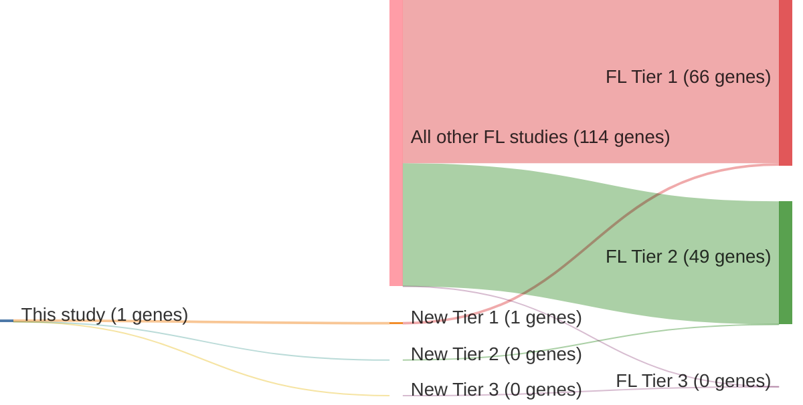

# @morinSomaticMutationsAltering2010a
## Summary of novel genes

|Entity| Tier 1 genes| Tier 2 genes|Tier 3 genes|
|:-:|:-:|:-:|:-:|
|FL|1|0|0|
|DLBCL|1|0|0|

## Novel genes reported in this study

### Tier 1
|New gene|FL tier|DLBCL tier|
|:-|:-:|:-:|
|[EZH2](../EZH2)|1 |1 |

# Details

