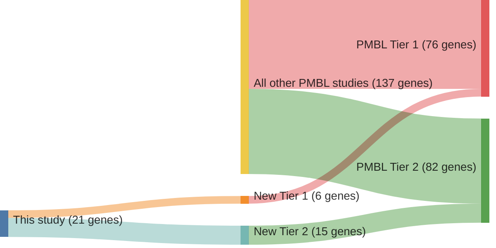

# @mottokIntegrativeGenomicAnalysis2019b
## Summary of novel genes

|Entity| Tier 1 genes| Tier 2 genes|
|:-:|:-:|:-:|
|PMBL|6|15|

## Novel genes reported in this study

### Tier 1
|New gene|PMBL tier|
|:-|:-:|
|[CISH](../CISH)|1 |
|[DDX3X](../DDX3X)|1 |
|[EZH2](../EZH2)|1 |
|[IRF8](../IRF8)|1 |
|[JAK1](../JAK1)|1 |
|[MS4A1](../MS4A1)|1 |

### Tier 2
|New gene|PMBL tier|
|:-|:-:|
|[CXCR5](../CXCR5)|2 |
|[EPHA7](../EPHA7)|2 |
|[GCSAM](../GCSAM)|2 |
|[HIST1H2BC](../HIST1H2BC)|2 |
|[HIST1H4E](../HIST1H4E)|2 |
|[HIST1H4J](../HIST1H4J)|2 |
|[IL13RA1](../IL13RA1)|2 |
|[IL1RAPL2](../IL1RAPL2)|2 |
|[IRF2BP2](../IRF2BP2)|2 |
|[IRF4](../IRF4)|2 |
|[JUNB](../JUNB)|2 |
|[MAGEC2](../MAGEC2)|2 |
|[NFKB2](../NFKB2)|2 |
|[RGS1](../RGS1)|2 |
|[VMP1](../VMP1)|2 |

# Details

