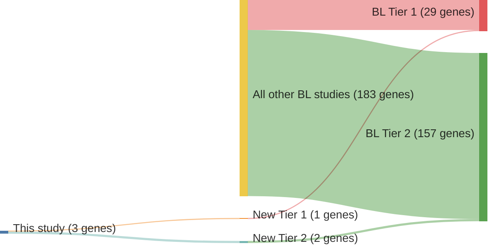

# @muppidiLossSignalingGa132014b
## Summary of novel genes

|Entity| Tier 1 genes| Tier 2 genes|
|:-:|:-:|:-:|
|BL|1|2|

## Novel genes reported in this study

|New gene|BL tier|
|:-|:-:|
|[ARHGEF1](ARHGEF1)|2 |
|[P2RY8](P2RY8)|1 |
|[S1PR2](S1PR2)|2 |

# Details

