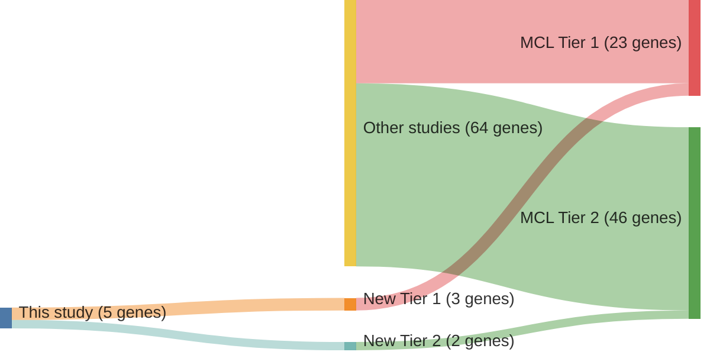

# @nadeuGenomicEpigenomicInsights2020b
## Summary of novel genes

|Entity| Tier 1 genes| Tier 2 genes|
|:-:|:-:|:-:|
|MCL|3|2|

## Novel genes reported in this study

|New gene|MCL tier|
|:-|:-:|
|[BCOR](BCOR)|2 |
|[SMARCA4](SMARCA4)|1 |
|[SMARCB1](SMARCB1)|2 |
|[SYNE1](SYNE1)|1 |
|[TERT](TERT)|1 |

# Details

