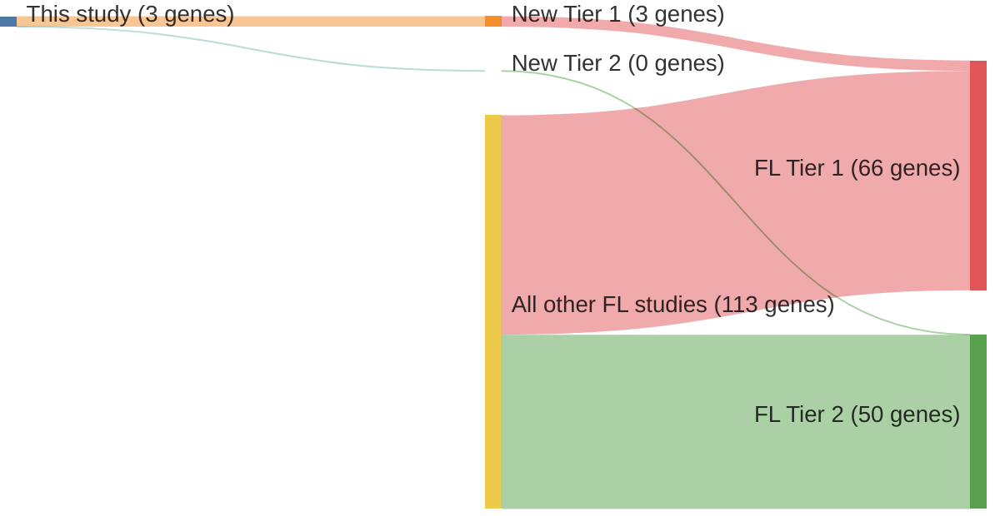

# @okosunRecurrentMTORC1activatingRRAGC2016a
## Summary of novel genes

|Entity| Tier 1 genes| Tier 2 genes|
|:-:|:-:|:-:|
|DLBCL|1|0|
|FL|3|0|

## Novel genes reported in this study

### Tier 1
|New gene|DLBCL tier|FL tier|
|:-|:-:|:-:|
|[ATP6AP1](../ATP6AP1)| |1 |
|[ATP6V1B2](../ATP6V1B2)| |1 |
|[RRAGC](../RRAGC)|1 |1 |

# Details

