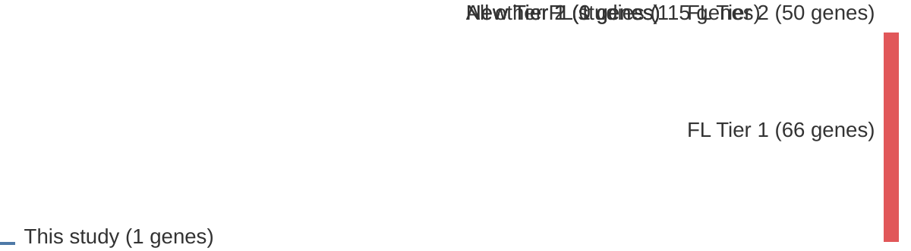

# @oricchioGeneticEpigeneticInactivation2017b
## Summary of novel genes

|Entity| Tier 1 genes| Tier 2 genes|
|:-:|:-:|:-:|
|FL||1|

## Novel genes reported in this study

|New gene|FL tier|
|:-|:-:|
|[SESN1](SESN1)|2 |

# Details

