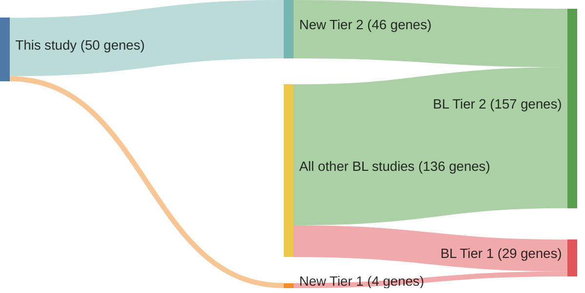

# @paneaWholeGenomeLandscape2019
## Summary of novel genes

|Entity| Tier 1 genes| Tier 2 genes|
|:-:|:-:|:-:|
|BL|4|46|

## Novel genes reported in this study

### Tier 1
|New gene|BL tier|
|:-|:-:|
|[BMP7](../BMP7)|1 |
|[EIF4A1](../EIF4A1)|1 |
|[EPPK1](../EPPK1)|1 |
|[HNRNPU](../HNRNPU)|1 |

### Tier 2
|New gene|BL tier|Rating of reviewed variants|
|:-|:-:|:-:|
|[ALPK2](../ALPK2)|2 | &starf; &star; &star; &star; &star;|
|[CARD11](../CARD11)|2 | &starf; &star; &star; &star; &star;|
|[CD79B](../CD79B)|2 | &starf; &star; &star; &star; &star;|
|[CD83](../CD83)|2 | &starf; &star; &star; &star; &star;|
|[CTCF](../CTCF)|2 | &starf; &star; &star; &star; &star;|
|[CXCR4](../CXCR4)|2 | &starf; &star; &star; &star; &star;|
|[DNMT1](../DNMT1)|2 | &starf; &star; &star; &star; &star;|
|[DTX1](../DTX1)|2 | &starf; &star; &star; &star; &star;|
|[EP300](../EP300)|2 | &starf; &star; &star; &star; &star;|
|[ETS1](../ETS1)|2 | &starf; &star; &star; &star; &star;|
|[FZD3](../FZD3)|2 | &starf; &star; &star; &star; &star;|
|[GRB2](../GRB2)|2 | &starf; &star; &star; &star; &star;|
|[HIST1H1C](../HIST1H1C)|2 | &starf; &star; &star; &star; &star;|
|[HIST1H2AG](../HIST1H2AG)|2 | &starf; &star; &star; &star; &star;|
|[HIST1H2AM](../HIST1H2AM)|2 | &star; &star; &star; &star; &star;|
|[HIST1H2BK](../HIST1H2BK)|2 | &star; &star; &star; &star; &star;|
|[HIST1H3D](../HIST1H3D)|2 |&star; &star; &star; &star; &star;|
|[HIST1H3H](../HIST1H3H)|2 |&star; &star; &star; &star; &star;|
|[HIST1H3I](../HIST1H3I)|2 |&star; &star; &star; &star; &star;|
|[HIST1H3J](../HIST1H3J)|2 |&star; &star; &star; &star; &star;|
|[HIST1H4J](../HIST1H4J)|2 |&star; &star; &star; &star; &star;|
|[IGLL5](../IGLL5)|2 |&star; &star; &star; &star; &star;|
|[IKZF3](../IKZF3)|2 |&star; &star; &star; &star; &star;|
|[IRF8](../IRF8)|2 |&star; &star; &star; &star; &star;|
|[KCNK10](../KCNK10)|2 |&star; &star; &star; &star; &star;|
|[KLHL6](../KLHL6)|2 |&star; &star; &star; &star; &star;|
|[LTB](../LTB)|2 |&star; &star; &star; &star; &star;|
|[MCL1](../MCL1)|2 |&star; &star; &star; &star; &star;|
|[MME](../MME)|2 |&star; &star; &star; &star; &star;|
|[MTOR](../MTOR)|2 |&star; &star; &star; &star; &star;|
|[NOTCH2](../NOTCH2)|2 |&star; &star; &star; &star; &star;|
|[PABPC4L](../PABPC4L)|2 |&star; &star; &star; &star; &star;|
|[PCDHA11](../PCDHA11)|2 |&star; &star; &star; &star; &star;|
|[PDZRN3](../PDZRN3)|2 |&star; &star; &star; &star; &star;|
|[PIK3R1](../PIK3R1)|2 |&star; &star; &star; &star; &star;|
|[PLCG2](../PLCG2)|2 |&star; &star; &star; &star; &star;|
|[PXDNL](../PXDNL)|2 |&star; &star; &star; &star; &star;|
|[RAC2](../RAC2)|2 |&star; &star; &star; &star; &star;|
|[RNF144B](../RNF144B)|2 |&star; &star; &star; &star; &star;|
|[SNTB2](../SNTB2)|2 |&star; &star; &star; &star; &star;|
|[SP3](../SP3)|2 |&star; &star; &star; &star; &star;|
|[SYNCRIP](../SYNCRIP)|2 |&star; &star; &star; &star; &star;|
|[TET2](../TET2)|2 |&star; &star; &star; &star; &star;|
|[WDR7](../WDR7)|2 |&star; &star; &star; &star; &star;|
|[WNK2](../WNK2)|2 |&star; &star; &star; &star; &star;|
|[ZFP36L1](../ZFP36L1)|2 |&star; &star; &star; &star; &star;|

# Details

