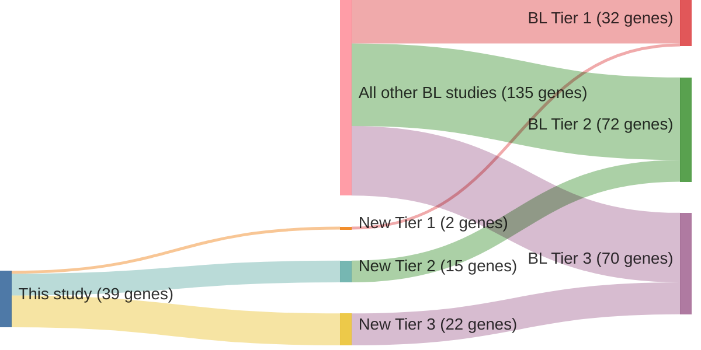

# @paneaWholeGenomeLandscape2019

## Summary
The 2019 study by Panea et al., titled *The Whole-Genome Landscape of Burkitt Lymphoma Subtypes*, provided a comprehensive analysis of the genetic mutations across various subtypes of Burkitt lymphoma (BL). The authors performed whole-genome sequencing on 101 BL tumors, identifying 72 driver genes and highlighting subtype-specific genetic alterations. ([Source](https://ashpublications.org/blood/article/134/19/1598/375002/The-whole-genome-landscape-of-Burkitt-lymphoma))

## Post-Publication Discussion
Subsequent scrutiny raised concerns about data accuracy and analysis methods. In a 2023 letter to the editor, Rushton et al. pointed out inconsistencies in the data, particularly regarding the overlap of potential driver variants among endemic and HIV-associated BL cases. ([Source](https://ashpublications.org/blood/article/142/10/936/486922/Burkitt-lymphoma-genomic-discovery-studies-drivers))

In response, the authors acknowledged these issues, attributing some discrepancies to errors in data merging, which led to the same variant being counted twice in certain cases. An erratum was published in September 2023, correcting data presentation and analyses, and providing a more detailed explanation of the methods used. ([Source](https://ashpublications.org/blood/article/142/10/940/497735/Panea-RI-Love-CL-Shingleton-JR-et-al-The-whole))

## Conclusion
While the original findings offered valuable insights into BL's genetic landscape, the subsequent corrections highlight the importance of data accuracy and transparency in genomic research. The developments underscore the need for ongoing validation and scrutiny in scientific studies. Of the novel genes reported in this study only two are Tier 1 BL genes with the rest in either Tier 2 or Tier 3.

## Summary of novel genes

|Entity| Tier 1 genes| Tier 2 genes|Tier 3 genes|
|:-:|:-:|:-:|:-:|
|BL|2|15|22|

## Novel genes reported in this study

### Tier 1
|New gene|BL tier| Average variant quality | QC outcome |
|:-|:-:|:-:|:-:|
|[BMP7](../BMP7)|1 || |
|[HNRNPU](../HNRNPU)|1 || |

### Tier 2
|New gene|BL tier| Average variant quality | QC outcome |
|:-|:-:|:-:|:-:|
|[CD83](../CD83)|2 |&starf; &starf; &starf; &star; &star; |PASS |
|[CXCR4](../CXCR4)|2 |&starf; &starf; &starf; &starf; &star; |PASS |
|[EIF4A1](../EIF4A1)|2 || |
|[EPPK1](../EPPK1)|2 || |
|[HIST1H3D](../HIST1H3D)|2 |&starf; &starf; &starf; &star; &star; |PASS |
|[HIST1H3I](../HIST1H3I)|2 |&starf; &starf; &starf; &starf; &star; |PASS |
|[HIST1H4J](../HIST1H4J)|2 |&starf; &starf; &starf; &star; &star; |PASS |
|[IGLL5](../IGLL5)|2 |&starf; &starf; &starf; &starf; &star; |PASS |
|[IKZF3](../IKZF3)|2 |&starf; &starf; &starf; &star; &star; |PASS |
|[IRF8](../IRF8)|2 |&starf; &starf; &starf; &starf; &star; |PASS |
|[MCL1](../MCL1)|2 |&starf; &starf; &starf; &starf; &star; |PASS |
|[PLCG2](../PLCG2)|2 |&starf; &starf; &starf; &star; &star; |PASS |
|[RNF144B](../RNF144B)|2 |&starf; &starf; &starf; &star; &star; |PASS |
|[WNK2](../WNK2)|2 |&starf; &starf; &starf; &starf; &star; |PASS |
|[ZFP36L1](../ZFP36L1)|2 |&starf; &starf; &starf; &starf; &star; |PASS |

### Tier 3
|New gene|BL tier| Average variant quality | QC outcome |
|:-|:-:|:-:|:-:|
|[ALPK2](../ALPK2)|3 |&starf; &star; &star; &star; &star; |FAIL |
|[CD79B](../CD79B)|3 |&starf; &starf; &star; &star; &star; |FAIL |
|[CTCF](../CTCF)|3 |&starf; &star; &star; &star; &star; |FAIL |
|[DNMT1](../DNMT1)|3 |&starf; &star; &star; &star; &star; |FAIL |
|[ETS1](../ETS1)|3 |&starf; &star; &star; &star; &star; |FAIL |
|[FZD3](../FZD3)|3 |&starf; &star; &star; &star; &star; |FAIL |
|[HIST1H1C](../HIST1H1C)|3 |&starf; &starf; &star; &star; &star; |FAIL |
|[HIST1H2AG](../HIST1H2AG)|3 |&starf; &starf; &star; &star; &star; |FAIL |
|[HIST1H2AM](../HIST1H2AM)|3 |&star; &star; &star; &star; &star; |FAIL |
|[HIST1H2BK](../HIST1H2BK)|3 |&starf; &star; &star; &star; &star; |FAIL |
|[HIST1H3H](../HIST1H3H)|3 |&star; &star; &star; &star; &star; |FAIL |
|[HIST1H3J](../HIST1H3J)|3 |&star; &star; &star; &star; &star; |FAIL |
|[KCNK10](../KCNK10)|3 |&starf; &starf; &star; &star; &star; |FAIL |
|[MME](../MME)|3 |&starf; &star; &star; &star; &star; |FAIL |
|[MTOR](../MTOR)|3 |&starf; &star; &star; &star; &star; |FAIL |
|[PABPC4L](../PABPC4L)|3 |&starf; &starf; &star; &star; &star; |FAIL |
|[PCDHA11](../PCDHA11)|3 |&starf; &star; &star; &star; &star; |FAIL |
|[PDZRN3](../PDZRN3)|3 |&starf; &star; &star; &star; &star; |FAIL |
|[PIK3R1](../PIK3R1)|3 |&starf; &star; &star; &star; &star; |FAIL |
|[PXDNL](../PXDNL)|3 |&starf; &star; &star; &star; &star; |FAIL |
|[SNTB2](../SNTB2)|3 |&starf; &starf; &star; &star; &star; |FAIL |
|[WDR7](../WDR7)|3 |&starf; &starf; &star; &star; &star; |FAIL |

# Details

