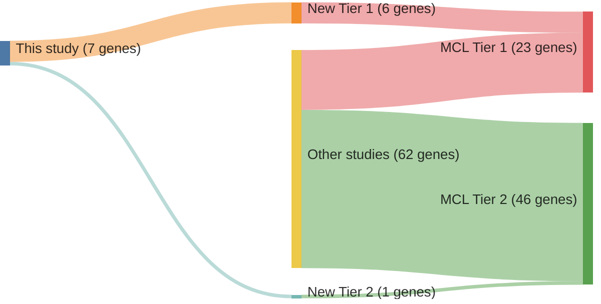

# @pararajalingamCodingNoncodingDrivers2020
## Summary of novel genes

|Entity| Tier 1 genes| Tier 2 genes|
|:-:|:-:|:-:|
|MCL|6|1|
|DLBCL|2|3|

## Novel genes reported in this study

|New gene|MCL tier|DLBCL tier|
|:-|:-:|:-:|
|[B2M](B2M)|2 |1 |
|[DAZAP1](DAZAP1)|1 |2 |
|[EWSR1](EWSR1)|1 | |
|[HNRNPH1](HNRNPH1)|1 |2 |
|[NFKBIE](NFKBIE)|1 |1 |
|[S1PR1](S1PR1)|1 | |
|[UBR5](UBR5)|1 |2 |

# Details

