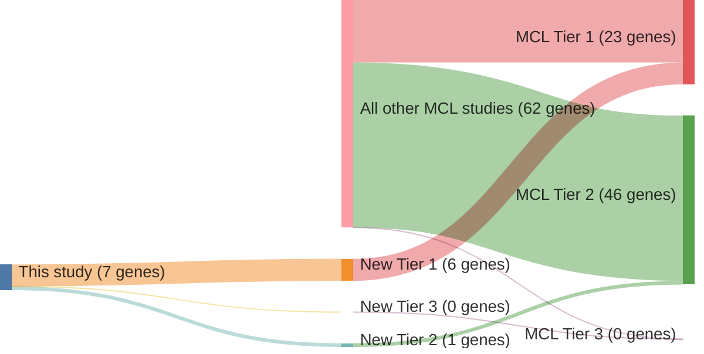

# @pararajalingamCodingNoncodingDrivers2020
## Summary of novel genes

|Entity| Tier 1 genes| Tier 2 genes|Tier 3 genes|
|:-:|:-:|:-:|:-:|
|DLBCL|2|4|0|
|MCL|6|1|0|

## Novel genes reported in this study

### Tier 1
|New gene|DLBCL tier|MCL tier|
|:-|:-:|:-:|
|[B2M](../B2M)|1 |2 |
|[DAZAP1](../DAZAP1)|2 |1 |
|[EWSR1](../EWSR1)| |1 |
|[HNRNPH1](../HNRNPH1)|2 |1 |
|[NFKBIE](../NFKBIE)|1 |1 |
|[S1PR1](../S1PR1)|2 |1 |
|[UBR5](../UBR5)|2 |1 |

# Details

