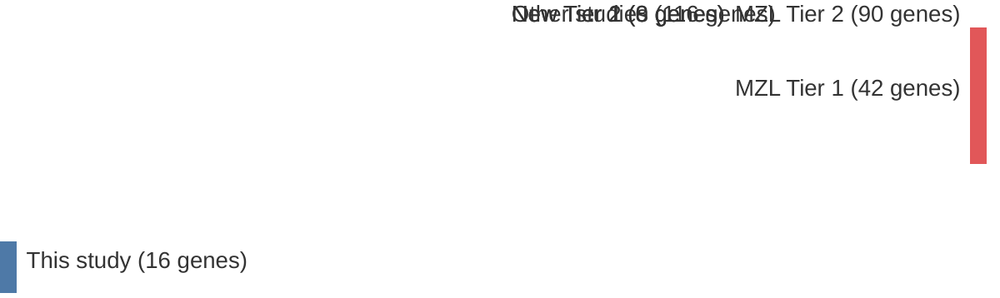

# @parryWholeExomeSequencing2013
## Summary of novel genes

|Entity| Tier 1 genes| Tier 2 genes|
|:-:|:-:|:-:|
|DLBCL|3|1|
|MZL||8|

## Novel genes reported in this study

|New gene|DLBCL tier|MZL tier|
|:-|:-:|:-:|
|[AMOTL1](AMOTL1)| |2 |
|[CBFA2T3](CBFA2T3)| |2 |
|[CREBBP](CREBBP)|1 |2 |
|[FAT4](FAT4)|2 |2 |
|[FBXO11](FBXO11)|1 |2 |
|[PLA2G4D](PLA2G4D)| |2 |
|[TRRAP](TRRAP)|1 |2 |
|[USH2A](USH2A)| |2 |

# Details

