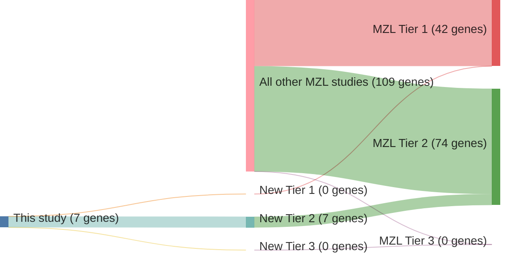

# @parryWholeExomeSequencing2013
## Summary of novel genes

|Entity| Tier 1 genes| Tier 2 genes|Tier 3 genes|
|:-:|:-:|:-:|:-:|
|MZL|0|7|0|

### Tier 2
|New gene|MZL tier|
|:-|:-:|
|[AMOTL1](../AMOTL1)|2 |
|[CBFA2T3](../CBFA2T3)|2 |
|[CREBBP](../CREBBP)|2 |
|[FAT4](../FAT4)|2 |
|[FBXO11](../FBXO11)|2 |
|[PLA2G4D](../PLA2G4D)|2 |
|[USH2A](../USH2A)|2 |

# Details

