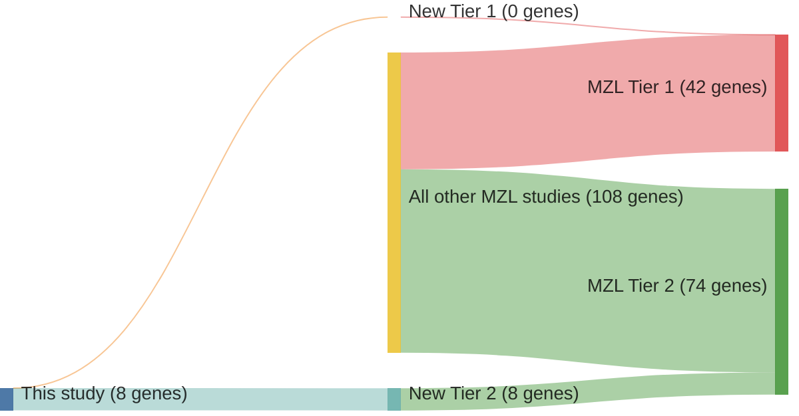

# @parryWholeExomeSequencing2013
## Summary of novel genes

|Entity| Tier 1 genes| Tier 2 genes|
|:-:|:-:|:-:|
|MZL|0|8|
|DLBCL|3|1|

## Novel genes reported in this study

|New gene|MZL tier|DLBCL tier|
|:-|:-:|:-:|
|[AMOTL1](AMOTL1)|2 | |
|[CBFA2T3](CBFA2T3)|2 | |
|[CREBBP](CREBBP)|2 |1 |
|[FAT4](FAT4)|2 |2 |
|[FBXO11](FBXO11)|2 |1 |
|[PLA2G4D](PLA2G4D)|2 | |
|[TRRAP](TRRAP)|2 |1 |
|[USH2A](USH2A)|2 | |

# Details

