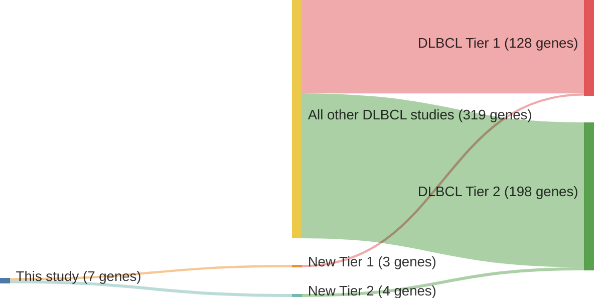

# @pasqualucciAnalysisCodingGenome2011
## Summary of novel genes

|Entity| Tier 1 genes| Tier 2 genes|
|:-:|:-:|:-:|
|DLBCL|3|4|

## Novel genes reported in this study

### Tier 1
|New gene|DLBCL tier|
|:-|:-:|
|[GRB2](../GRB2)|1 |
|[KLF2](../KLF2)|1 |
|[NOTCH1](../NOTCH1)|1 |

### Tier 2
|New gene|DLBCL tier|
|:-|:-:|
|[CD36](../CD36)|2 |
|[HNF1B](../HNF1B)|2 |
|[MYOM2](../MYOM2)|2 |
|[TRAF3](../TRAF3)|2 |

# Details

