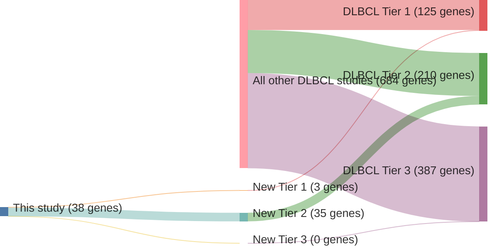

# @pasqualucciAnalysisCodingGenome2011
## Summary of novel genes

|Entity| Tier 1 genes| Tier 2 genes|Tier 3 genes|
|:-:|:-:|:-:|:-:|
|DLBCL|3|35|0|

## Novel genes reported in this study

### Tier 1
|New gene|DLBCL tier|
|:-|:-:|
|[GRB2](../GRB2)|1 |
|[KLF2](../KLF2)|1 |
|[NOTCH1](../NOTCH1)|1 |

### Tier 2
|New gene|DLBCL tier|
|:-|:-:|
|[ADAMTSL3](../ADAMTSL3)|2 |
|[AKAP8](../AKAP8)|2 |
|[ANKLE2](../ANKLE2)|2 |
|[BCL2L10](../BCL2L10)|2 |
|[BRSK1](../BRSK1)|2 |
|[C12orf35](../C12orf35)|2 |
|[CAMTA1](../CAMTA1)|2 |
|[CD36](../CD36)|2 |
|[CYTSB](../CYTSB)|2 |
|[DCHS1](../DCHS1)|2 |
|[DPYD](../DPYD)|2 |
|[DSC3](../DSC3)|2 |
|[DUSP27](../DUSP27)|2 |
|[DUSP9](../DUSP9)|2 |
|[FBXO31](../FBXO31)|2 |
|[HMGB1](../HMGB1)|2 |
|[HNF1B](../HNF1B)|2 |
|[KDM2B](../KDM2B)|2 |
|[MAGEC3](../MAGEC3)|2 |
|[MED12L](../MED12L)|2 |
|[MTMR8](../MTMR8)|2 |
|[MYO1G](../MYO1G)|2 |
|[MYOM2](../MYOM2)|2 |
|[OFD1](../OFD1)|2 |
|[PMS1](../PMS1)|2 |
|[PPP2R5A](../PPP2R5A)|2 |
|[RASGEF1A](../RASGEF1A)|2 |
|[RGAG1](../RGAG1)|2 |
|[SERPINA1](../SERPINA1)|2 |
|[SMARCA1](../SMARCA1)|2 |
|[TLL2](../TLL2)|2 |
|[TRAF3](../TRAF3)|2 |
|[TSC22D1](../TSC22D1)|2 |
|[ZNF521](../ZNF521)|2 |
|[ZWILCH](../ZWILCH)|2 |

# Details

