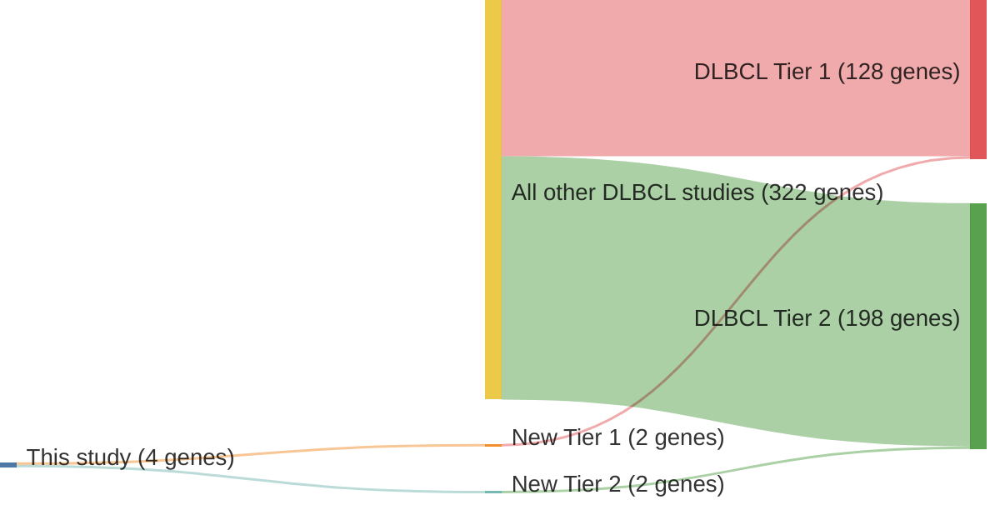

# @pasqualucciHypermutationMultipleProtooncogenes2001a
## Summary of novel genes

|Entity| Tier 1 genes| Tier 2 genes|
|:-:|:-:|:-:|
|DLBCL|2|2|

## Novel genes reported in this study

### Tier 1
|New gene|DLBCL tier|
|:-|:-:|
|[MYC](../MYC)|1 |
|[PIM1](../PIM1)|1 |

### Tier 2
|New gene|DLBCL tier|
|:-|:-:|
|[PAX5](../PAX5)|2 |
|[RHOH](../RHOH)|2 |

# Details

