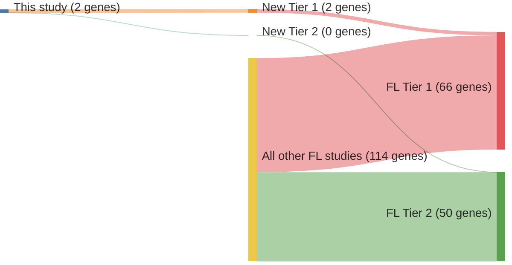

# @pasqualucciInactivatingMutationsAcetyltransferase2011a
## Summary of novel genes

|Entity| Tier 1 genes| Tier 2 genes|
|:-:|:-:|:-:|
|DLBCL|2|0|
|FL|2|0|

## Novel genes reported in this study

|New gene|DLBCL tier|FL tier|
|:-|:-:|:-:|
|[CREBBP](CREBBP)|1 |1 |
|[EP300](EP300)|1 |1 |

# Details

