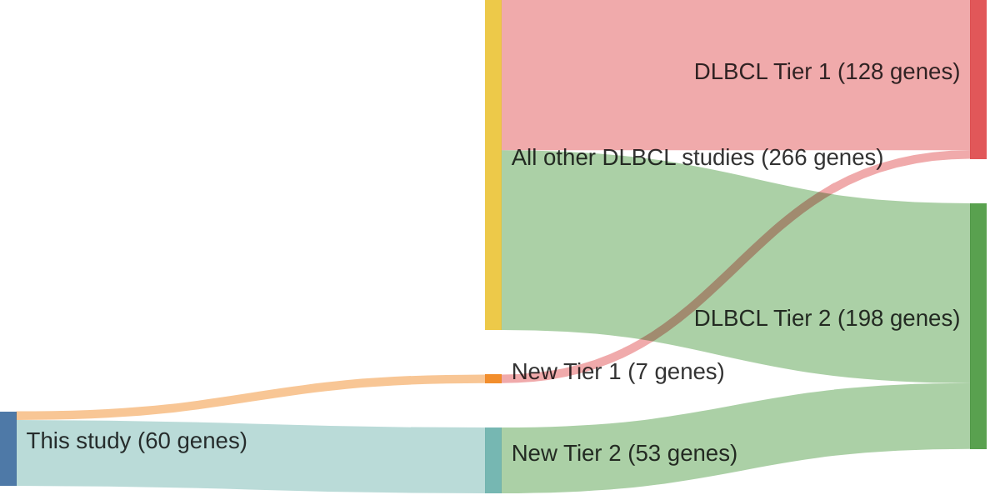

# @reddyGeneticFunctionalDrivers2017
## Summary of novel genes

|Entity| Tier 1 genes| Tier 2 genes|
|:-:|:-:|:-:|
|DLBCL|7|53|

## Novel genes reported in this study

### Tier 1
|New gene|DLBCL tier|
|:-|:-:|
|[ATM](../ATM)|1 |
|[BIRC6](../BIRC6)|1 |
|[HIST1H2BC](../HIST1H2BC)|1 |
|[HNRNPU](../HNRNPU)|1 |
|[SETD1B](../SETD1B)|1 |
|[TOX](../TOX)|1 |
|[UBE2A](../UBE2A)|1 |

### Tier 2
|New gene|DLBCL tier|Rating of reviewed variants|
|:-|:-:|:-:|
|[ANKRD17](../ANKRD17)|2 |&starf; &starf; &starf; &star; &star;|
|[ARID1B](../ARID1B)|2 |&starf; &starf; &star; &star; &star;|
|[ARID5B](../ARID5B)|2 |&starf; &starf; &starf; &starf; &star;|
|[ATR](../ATR)|2 |&starf; &starf; &starf; &star; &star;|
|[BRINP3](../BRINP3)|2 |&starf; &starf; &starf; &star; &star;|
|[BTBD3](../BTBD3)|2 |&starf; &starf; &starf; &starf; &star;|
|[CASP8](../CASP8)|2 |&starf; &starf; &starf; &star; &star;|
|[CBLB](../CBLB)|2 |&starf; &starf; &star; &star; &star;|
|[CD22](../CD22)|2 |&starf; &starf; &starf; &star; &star;|
|[CDC73](../CDC73)|2 |&starf; &starf; &star; &star; &star;|
|[CHD1](../CHD1)|2 |&starf; &starf; &star; &star; &star;|
|[CHD8](../CHD8)|2 |&starf; &starf; &star; &star; &star;|
|[CHST2](../CHST2)|2 |&starf; &starf; &star; &star; &star;|
|[DCAF6](../DCAF6)|2 |&starf; &starf; &star; &star; &star;|
|[DDX10](../DDX10)|2 |&starf; &starf; &star; &star; &star;|
|[DICER1](../DICER1)|2 |&starf; &starf; &star; &star; &star;|
|[DNMT3A](../DNMT3A)|2 ||
|[FOXP1](../FOXP1)|2 ||
|[FUBP1](../FUBP1)|2 ||
|[GNAS](../GNAS)|2 ||
|[GOLGA5](../GOLGA5)|2 ||
|[HRAS](../HRAS)|2 ||
|[IKBKB](../IKBKB)|2 ||
|[JUNB](../JUNB)|2 ||
|[KCMF1](../KCMF1)|2 ||
|[LIN54](../LIN54)|2 ||
|[MAGT1](../MAGT1)|2 ||
|[MAP4K4](../MAP4K4)|2 ||
|[MARK1](../MARK1)|2 ||
|[MCL1](../MCL1)|2 ||
|[MECOM](../MECOM)|2 ||
|[MET](../MET)|2 ||
|[MSH2](../MSH2)|2 ||
|[MSH6](../MSH6)|2 ||
|[MYB](../MYB)|2 ||
|[NCOR1](../NCOR1)|2 ||
|[NF1](../NF1)|2 ||
|[NFKB2](../NFKB2)|2 ||
|[PHF6](../PHF6)|2 ||
|[PIK3CD](../PIK3CD)|2 ||
|[PTPN6](../PTPN6)|2 ||
|[PTPRK](../PTPRK)|2 ||
|[RARA](../RARA)|2 ||
|[RUNX1](../RUNX1)|2 ||
|[SETD5](../SETD5)|2 ||
|[SYK](../SYK)|2 ||
|[TGFBR2](../TGFBR2)|2 ||
|[TIPARP](../TIPARP)|2 ||
|[WAC](../WAC)|2 ||
|[YY1](../YY1)|2 ||
|[ZBTB7A](../ZBTB7A)|2 ||
|[ZFAT](../ZFAT)|2 ||
|[ZFX](../ZFX)|2 ||

# Details

