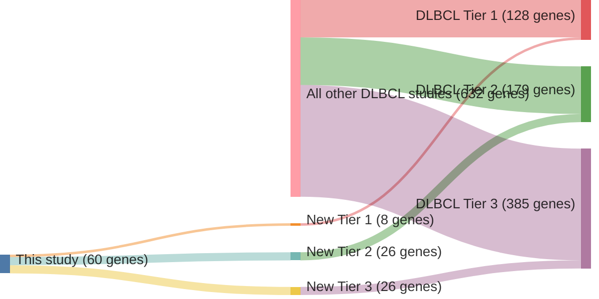

# @reddyGeneticFunctionalDrivers2017
## Summary of novel genes

|Entity| Tier 1 genes| Tier 2 genes|Tier 3 genes|
|:-:|:-:|:-:|:-:|
|DLBCL|8|26|26|

## Novel genes reported in this study

### Tier 1
|New gene|DLBCL tier| Average variant quality | QC outcome |
|:-|:-:|:-:|:-:|
|[ATM](../ATM)|1 || |
|[BIRC6](../BIRC6)|1 || |
|[DDX3X](../DDX3X)|1 || |
|[HNRNPU](../HNRNPU)|1 || |
|[MGA](../MGA)|1 || |
|[PTEN](../PTEN)|1 || |
|[SF3B1](../SF3B1)|1 || |
|[TOX](../TOX)|1 || |

### Tier 2
|New gene|DLBCL tier| Average variant quality | QC outcome |
|:-|:-:|:-:|:-:|
|[ARID5B](../ARID5B)|2 |&starf; &starf; &starf; &starf; &star; |PASS |
|[ATR](../ATR)|2 |&starf; &starf; &starf; &star; &star; |PASS |
|[BRINP3](../BRINP3)|2 |&starf; &starf; &starf; &star; &star; |PASS |
|[CASP8](../CASP8)|2 || |
|[CD22](../CD22)|2 |&starf; &starf; &starf; &star; &star; |PASS |
|[FOXP1](../FOXP1)|2 |&starf; &starf; &starf; &star; &star; |PASS |
|[FUBP1](../FUBP1)|2 |&starf; &starf; &starf; &star; &star; |PASS |
|[GOLGA5](../GOLGA5)|2 |&starf; &starf; &starf; &star; &star; |PASS |
|[HNRNPD](../HNRNPD)|2 || |
|[IKBKB](../IKBKB)|2 |&starf; &starf; &starf; &star; &star; |PASS |
|[IL16](../IL16)|2 || |
|[JUNB](../JUNB)|2 |&starf; &starf; &starf; &star; &star; |PASS |
|[KCMF1](../KCMF1)|2 |&starf; &starf; &starf; &star; &star; |PASS |
|[MAGT1](../MAGT1)|2 |&starf; &starf; &starf; &star; &star; |PASS |
|[MCL1](../MCL1)|2 |&starf; &starf; &starf; &star; &star; |PASS |
|[MECOM](../MECOM)|2 |&starf; &starf; &starf; &star; &star; |PASS |
|[MET](../MET)|2 |&starf; &starf; &starf; &star; &star; |PASS |
|[MSH6](../MSH6)|2 |&starf; &starf; &starf; &star; &star; |PASS |
|[NF1](../NF1)|2 |&starf; &starf; &starf; &star; &star; |PASS |
|[PTPN6](../PTPN6)|2 |&starf; &starf; &starf; &star; &star; |PASS |
|[SETD5](../SETD5)|2 |&starf; &starf; &starf; &star; &star; |PASS |
|[TCL1A](../TCL1A)|2 || |
|[TGFBR2](../TGFBR2)|2 |&starf; &starf; &starf; &star; &star; |PASS |
|[TIPARP](../TIPARP)|2 |&starf; &starf; &starf; &star; &star; |PASS |
|[YY1](../YY1)|2 |&starf; &starf; &starf; &star; &star; |PASS |
|[ZFX](../ZFX)|2 |&starf; &starf; &starf; &star; &star; |PASS |

### Tier 3
|New gene|DLBCL tier| Average variant quality | QC outcome |
|:-|:-:|:-:|:-:|
|[ARID1B](../ARID1B)|3 |&starf; &starf; &star; &star; &star; |FAIL |
|[CBLB](../CBLB)|3 |&starf; &starf; &star; &star; &star; |FAIL |
|[CDC73](../CDC73)|3 |&starf; &starf; &star; &star; &star; |FAIL |
|[CDH8](../CDH8)|3 |&starf; &starf; &star; &star; &star; |FAIL |
|[CHD1](../CHD1)|3 |&starf; &starf; &star; &star; &star; |FAIL |
|[CHST2](../CHST2)|3 |&starf; &starf; &star; &star; &star; |FAIL |
|[DCAF6](../DCAF6)|3 |&starf; &starf; &star; &star; &star; |FAIL |
|[DICER1](../DICER1)|3 |&starf; &starf; &star; &star; &star; |FAIL |
|[DNMT3A](../DNMT3A)|3 |&starf; &star; &star; &star; &star; |FAIL |
|[GNAS](../GNAS)|3 |&starf; &starf; &star; &star; &star; |FAIL |
|[HRAS](../HRAS)|3 |&starf; &starf; &star; &star; &star; |FAIL |
|[LIN54](../LIN54)|3 |&starf; &starf; &star; &star; &star; |FAIL |
|[MAP4K4](../MAP4K4)|3 |&starf; &starf; &star; &star; &star; |FAIL |
|[MARK1](../MARK1)|3 |&starf; &star; &star; &star; &star; |FAIL |
|[MSH2](../MSH2)|3 |&starf; &starf; &star; &star; &star; |FAIL |
|[MYB](../MYB)|3 |&starf; &starf; &star; &star; &star; |FAIL |
|[NCOR1](../NCOR1)|3 |&starf; &starf; &star; &star; &star; |FAIL |
|[NFKB2](../NFKB2)|3 |&starf; &starf; &star; &star; &star; |FAIL |
|[PHF6](../PHF6)|3 |&starf; &starf; &star; &star; &star; |FAIL |
|[PTPRK](../PTPRK)|3 |&starf; &starf; &star; &star; &star; |FAIL |
|[RARA](../RARA)|3 |&starf; &star; &star; &star; &star; |FAIL |
|[RUNX1](../RUNX1)|3 |&starf; &starf; &star; &star; &star; |FAIL |
|[SYK](../SYK)|3 |&starf; &starf; &star; &star; &star; |FAIL |
|[WAC](../WAC)|3 |&starf; &starf; &star; &star; &star; |FAIL |
|[ZBTB7A](../ZBTB7A)|3 |&starf; &star; &star; &star; &star; |FAIL |
|[ZFAT](../ZFAT)|3 |&starf; &starf; &star; &star; &star; |FAIL |

# Details

