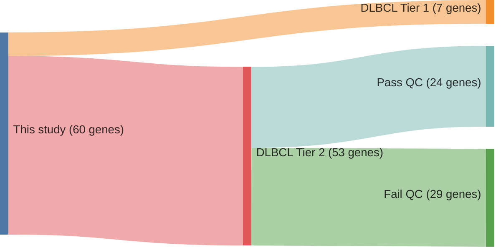

# @reddyGeneticFunctionalDrivers2017
## Summary of novel genes

|Entity| Tier 1 genes| Tier 2 genes|
|:-:|:-:|:-:|
|DLBCL|7|53|

## Novel genes reported in this study

### Tier 1

|Novel gene|DLBCL tier|Average variant quality|
|:-|:-:|:-:|
|[ATM](../ATM)|1 |&starf; &starf; &starf; &star; &star;|
|[BIRC6](../BIRC6)|1 |&starf; &starf; &starf; &star; &star;|
|[HIST1H2BC](../HIST1H2BC)|1 |&starf; &starf; &starf; &starf; &star;|
|[HNRNPU](../HNRNPU)|1 |&starf; &starf; &starf; &star; &star;|
|[SETD1B](../SETD1B)|1 |&starf; &starf; &star; &star; &star;|
|[TOX](../TOX)|1 |&starf; &starf; &starf; &star; &star;|
|[UBE2A](../UBE2A)|1 |&starf; &starf; &starf; &star; &star;|

### Tier 2

|Novel gene|DLBCL tier|Average variant quality|QC outcome|
|:-|:-:|:-:|:-:|
|[ARID5B](../ARID5B)|2 |&starf; &starf; &starf; &starf; &star;|**Pass**|
|[BTBD3](../BTBD3)|2 |&starf; &starf; &starf; &starf; &star;|**Pass**|
|[SETD5](../SETD5)|2 |&starf; &starf; &starf; &star; &star;|**Pass**|
|[ATR](../ATR)|2 |&starf; &starf; &starf; &star; &star;|**Pass**|
|[BRINP3](../BRINP3)|2 |&starf; &starf; &starf; &star; &star;|**Pass**|
|[CASP8](../CASP8)|2 |&starf; &starf; &starf; &star; &star;|**Pass**|
|[TGFBR2](../TGFBR2)|2 |&starf; &starf; &starf; &star; &star;|**Pass**|
|[TIPARP](../TIPARP)|2 |&starf; &starf; &starf; &star; &star;|**Pass**|
|[CD22](../CD22)|2 |&starf; &starf; &starf; &star; &star;|**Pass**|
|[NF1](../NF1)|2 |&starf; &starf; &starf; &star; &star;|**Pass**|
|[IKBKB](../IKBKB)|2 |&starf; &starf; &starf; &star; &star;|**Pass**|
|[JUNB](../JUNB)|2 |&starf; &starf; &starf; &star; &star;|**Pass**|
|[KCMF1](../KCMF1)|2 |&starf; &starf; &starf; &star; &star;|**Pass**|
|[MAGT1](../MAGT1)|2 |&starf; &starf; &starf; &star; &star;|**Pass**|
|[MECOM](../MECOM)|2 |&starf; &starf; &starf; &star; &star;|**Pass**|
|[PTPN6](../PTPN6)|2 |&starf; &starf; &starf; &star; &star;|**Pass**|
|[MET](../MET)|2 |&starf; &starf; &starf; &star; &star;|**Pass**|
|[ZFX](../ZFX)|2 |&starf; &starf; &starf; &star; &star;|**Pass**|
|[YY1](../YY1)|2 |&starf; &starf; &starf; &star; &star;|**Pass**|
|[FOXP1](../FOXP1)|2 |&starf; &starf; &starf; &star; &star;|**Pass**|
|[FUBP1](../FUBP1)|2 |&starf; &starf; &starf; &star; &star;|**Pass**|
|[GOLGA5](../GOLGA5)|2 |&starf; &starf; &starf; &star; &star;|**Pass**|
|[MSH6](../MSH6)|2 |&starf; &starf; &starf; &star; &star;|**Pass**|
|[MCL1](../MCL1)|2 |&starf; &starf; &starf; &star; &star;|**Pass**|
|[ANKRD17](../ANKRD17)|2 |&starf; &starf; &starf; &star; &star;|**Fail**|
|[CDC73](../CDC73)|2 |&starf; &starf; &star; &star; &star;|**Fail**|
|[CHD1](../CHD1)|2 |&starf; &starf; &star; &star; &star;|**Fail**|
|[CHD8](../CHD8)|2 |&starf; &starf; &star; &star; &star;|**Fail**|
|[CHST2](../CHST2)|2 |&starf; &starf; &star; &star; &star;|**Fail**|
|[DCAF6](../DCAF6)|2 |&starf; &starf; &star; &star; &star;|**Fail**|
|[DDX10](../DDX10)|2 |&starf; &starf; &star; &star; &star;|**Fail**|
|[DICER1](../DICER1)|2 |&starf; &starf; &star; &star; &star;|**Fail**|
|[HRAS](../HRAS)|2 |&starf; &starf; &star; &star; &star;|**Fail**|
|[LIN54](../LIN54)|2 |&starf; &starf; &star; &star; &star;|**Fail**|
|[MAP4K4](../MAP4K4)|2 |&starf; &starf; &star; &star; &star;|**Fail**|
|[MSH2](../MSH2)|2 |&starf; &starf; &star; &star; &star;|**Fail**|
|[GNAS](../GNAS)|2 |&starf; &starf; &star; &star; &star;|**Fail**|
|[MYB](../MYB)|2 |&starf; &starf; &star; &star; &star;|**Fail**|
|[NCOR1](../NCOR1)|2 |&starf; &starf; &star; &star; &star;|**Fail**|
|[NFKB2](../NFKB2)|2 |&starf; &starf; &star; &star; &star;|**Fail**|
|[PHF6](../PHF6)|2 |&starf; &starf; &star; &star; &star;|**Fail**|
|[PIK3CD](../PIK3CD)|2 |&starf; &starf; &star; &star; &star;|**Fail**|
|[PTPRK](../PTPRK)|2 |&starf; &starf; &star; &star; &star;|**Fail**|
|[ZFAT](../ZFAT)|2 |&starf; &starf; &star; &star; &star;|**Fail**|
|[ARID1B](../ARID1B)|2 |&starf; &starf; &star; &star; &star;|**Fail**|
|[RUNX1](../RUNX1)|2 |&starf; &starf; &star; &star; &star;|**Fail**|
|[CBLB](../CBLB)|2 |&starf; &starf; &star; &star; &star;|**Fail**|
|[SYK](../SYK)|2 |&starf; &starf; &star; &star; &star;|**Fail**|
|[WAC](../WAC)|2 |&starf; &starf; &star; &star; &star;|**Fail**|
|[ZBTB7A](../ZBTB7A)|2 |&starf; &star; &star; &star; &star;|**Fail**|
|[RARA](../RARA)|2 |&starf; &star; &star; &star; &star;|**Fail**|
|[DNMT3A](../DNMT3A)|2 |&starf; &star; &star; &star; &star;|**Fail**|
|[MARK1](../MARK1)|2 |&starf; &star; &star; &star; &star;|**Fail**|

## See Also

The primary data supporting each of the mutations reported in this study can be viewed in [IGV reports](https://www.bcgsc.ca/downloads/morinlab/GAMBL/Reddy/igv_reports/) along with mutations unique to the GAMBL re-analysis.[@drevalRevisitingReddyDLBCL2023] 

# References

