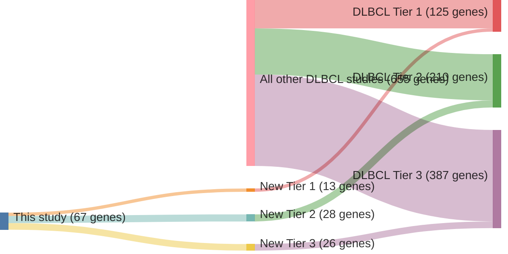

# @reddyGeneticFunctionalDrivers2017

## Study Overview
Reddy et al. conducted a comprehensive analysis of Diffuse Large B Cell Lymphoma (DLBCL) using the exomes of 1,001 cases, identifying **150 driver genes**. Their findings provided significant insights into the genetic alterations and functional pathways underlying DLBCL. Key outcomes of the study included:

### Key Findings
1. **Recurrent Mutations**:
   - Identified mutations in genes such as **MYD88**, **CD79B**, **EZH2**, and **TP53**, highlighting their importance in DLBCL pathogenesis.

2. **Pathway Analysis**:
   - Mutations impacted key signaling pathways, including:
     - **B-cell receptor signaling**
     - **NF-κB signaling**
     - **Chromatin modification**

3. **Molecular Subtypes**:
   - Contributed to the molecular classification of DLBCL into subtypes like **germinal center B-cell-like (GCB)** and **activated B-cell-like (ABC)**, with distinct genetic and clinical features.

4. **Therapeutic Implications**:
   - Suggested potential targeted therapies focusing on B-cell receptor and NF-κB pathways, among others.

This research represented a foundational step in understanding the genetic drivers of DLBCL, informing therapeutic development.

---

## Post-Publication Critical Analysis
Subsequent scrutiny of the study revealed significant issues with its findings:

1. **Reanalysis of Data**:
   - A 2023 preprint by Dreval et al. reanalyzed the original data using open-source pipelines and uncovered **discrepancies** in the findings.

2. **Variant Reproducibility**:
   - Thousands of mutations reported by Reddy et al. could not be independently reproduced, raising concerns about the reliability of the variant-calling methods.

3. **Mutation Prevalence**:
   - Clinically important mutations, such as those in **EZH2** and **CD79B**, were underrepresented in the original findings.

4. **Analytical Errors**:
   - Errors in the original data analysis pipeline were identified, potentially affecting the accuracy of genetic alteration reporting.

---

## Implications and Lessons
The 2017 study provided valuable insights into DLBCL's genetic landscape and functional pathways. However, subsequent critical analyses underscore the need for:

1. **Rigorous Data Validation**:
   - Ensuring reproducibility of findings by using standardized, open-source pipelines.

2. **Transparency in Methods**:
   - Clear documentation of analytical approaches to allow independent verification.

3. **Reevaluation of Findings**:
   - Revisiting conclusions with improved methodologies to refine our understanding of DLBCL pathogenesis.

While the original study remains influential in the field, its findings must be interpreted with caution in light of these critiques. Ongoing research will continue to refine the genetic and functional drivers of DLBCL, ensuring a more accurate and actionable understanding of this heterogeneous disease.

## Summary of novel genes

|Entity| Tier 1 genes| Tier 2 genes|Tier 3 genes|
|:-:|:-:|:-:|:-:|
|DLBCL|13|28|26|

## Novel genes reported in this study

### Tier 1
|New gene|DLBCL tier| Average variant quality | QC outcome |
|:-|:-:|:-:|:-:|
|[ATM](../ATM)|1 || |
|[BIRC6](../BIRC6)|1 || |
|[DDX3X](../DDX3X)|1 || |
|[HNRNPU](../HNRNPU)|1 || |
|[MGA](../MGA)|1 || |
|[PIM2](../PIM2)|1 || |
|[PTEN](../PTEN)|1 || |
|[PTPN6](../PTPN6)|1 |&starf; &starf; &starf; &star; &star; |PASS |
|[SF3B1](../SF3B1)|1 || |
|[SMARCA4](../SMARCA4)|1 || |
|[TMSB4X](../TMSB4X)|1 || |
|[TOX](../TOX)|1 || |
|[ZNF292](../ZNF292)|1 || |

### Tier 2
|New gene|DLBCL tier| Average variant quality | QC outcome |
|:-|:-:|:-:|:-:|
|[ARID5B](../ARID5B)|2 |&starf; &starf; &starf; &starf; &star; |PASS |
|[ATR](../ATR)|2 |&starf; &starf; &starf; &star; &star; |PASS |
|[BRINP3](../BRINP3)|2 |&starf; &starf; &starf; &star; &star; |PASS |
|[CASP8](../CASP8)|2 || |
|[CD22](../CD22)|2 |&starf; &starf; &starf; &star; &star; |PASS |
|[FOXP1](../FOXP1)|2 |&starf; &starf; &starf; &star; &star; |PASS |
|[FUBP1](../FUBP1)|2 |&starf; &starf; &starf; &star; &star; |PASS |
|[GOLGA5](../GOLGA5)|2 |&starf; &starf; &starf; &star; &star; |PASS |
|[HNRNPD](../HNRNPD)|2 || |
|[IKBKB](../IKBKB)|2 |&starf; &starf; &starf; &star; &star; |PASS |
|[IL16](../IL16)|2 || |
|[INO80](../INO80)|2 || |
|[JAK1](../JAK1)|2 || |
|[JAK3](../JAK3)|2 || |
|[KCMF1](../KCMF1)|2 |&starf; &starf; &starf; &star; &star; |PASS |
|[MAGT1](../MAGT1)|2 |&starf; &starf; &starf; &star; &star; |PASS |
|[MCL1](../MCL1)|2 |&starf; &starf; &starf; &star; &star; |PASS |
|[MECOM](../MECOM)|2 |&starf; &starf; &starf; &star; &star; |PASS |
|[MET](../MET)|2 |&starf; &starf; &starf; &star; &star; |PASS |
|[MSH6](../MSH6)|2 |&starf; &starf; &starf; &star; &star; |PASS |
|[SETD5](../SETD5)|2 |&starf; &starf; &starf; &star; &star; |PASS |
|[STAT5B](../STAT5B)|2 || |
|[TCL1A](../TCL1A)|2 || |
|[TGFBR2](../TGFBR2)|2 |&starf; &starf; &starf; &star; &star; |PASS |
|[TIPARP](../TIPARP)|2 |&starf; &starf; &starf; &star; &star; |PASS |
|[YY1](../YY1)|2 |&starf; &starf; &starf; &star; &star; |PASS |
|[ZEB2](../ZEB2)|2 || |
|[ZFX](../ZFX)|2 |&starf; &starf; &starf; &star; &star; |PASS |

### Tier 3
|New gene|DLBCL tier| Average variant quality | QC outcome |
|:-|:-:|:-:|:-:|
|[ARID1B](../ARID1B)|3 |&starf; &starf; &star; &star; &star; |FAIL |
|[CBLB](../CBLB)|3 |&starf; &starf; &star; &star; &star; |FAIL |
|[CDC73](../CDC73)|3 |&starf; &starf; &star; &star; &star; |FAIL |
|[CDH8](../CDH8)|3 |&starf; &starf; &star; &star; &star; |FAIL |
|[CHD1](../CHD1)|3 |&starf; &starf; &star; &star; &star; |FAIL |
|[CHST2](../CHST2)|3 |&starf; &starf; &star; &star; &star; |FAIL |
|[DCAF6](../DCAF6)|3 |&starf; &starf; &star; &star; &star; |FAIL |
|[DICER1](../DICER1)|3 |&starf; &starf; &star; &star; &star; |FAIL |
|[DNMT3A](../DNMT3A)|3 |&starf; &star; &star; &star; &star; |FAIL |
|[GNAS](../GNAS)|3 |&starf; &starf; &star; &star; &star; |FAIL |
|[HRAS](../HRAS)|3 |&starf; &starf; &star; &star; &star; |FAIL |
|[LIN54](../LIN54)|3 |&starf; &starf; &star; &star; &star; |FAIL |
|[MAP4K4](../MAP4K4)|3 |&starf; &starf; &star; &star; &star; |FAIL |
|[MARK1](../MARK1)|3 |&starf; &star; &star; &star; &star; |FAIL |
|[MSH2](../MSH2)|3 |&starf; &starf; &star; &star; &star; |FAIL |
|[MYB](../MYB)|3 |&starf; &starf; &star; &star; &star; |FAIL |
|[NCOR1](../NCOR1)|3 |&starf; &starf; &star; &star; &star; |FAIL |
|[NFKB2](../NFKB2)|3 |&starf; &starf; &star; &star; &star; |FAIL |
|[PHF6](../PHF6)|3 |&starf; &starf; &star; &star; &star; |FAIL |
|[PTPRK](../PTPRK)|3 |&starf; &starf; &star; &star; &star; |FAIL |
|[RARA](../RARA)|3 |&starf; &star; &star; &star; &star; |FAIL |
|[RUNX1](../RUNX1)|3 |&starf; &starf; &star; &star; &star; |FAIL |
|[SYK](../SYK)|3 |&starf; &starf; &star; &star; &star; |FAIL |
|[WAC](../WAC)|3 |&starf; &starf; &star; &star; &star; |FAIL |
|[ZBTB7A](../ZBTB7A)|3 |&starf; &star; &star; &star; &star; |FAIL |
|[ZFAT](../ZFAT)|3 |&starf; &starf; &star; &star; &star; |FAIL |

# Details

