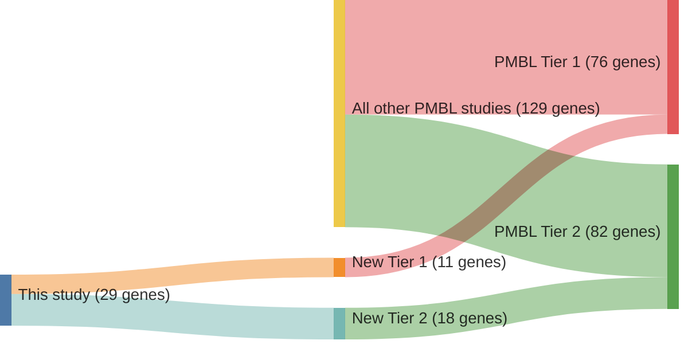

# @reichelFlowSortingExome2015a
## Summary of novel genes

|Entity| Tier 1 genes| Tier 2 genes|
|:-:|:-:|:-:|
|PMBL|11|18|

## Novel genes reported in this study

### Tier 1
|New gene|PMBL tier|
|:-|:-:|
|[B2M](../B2M)|1 |
|[CSF2RB](../CSF2RB)|1 |
|[EBF1](../EBF1)|1 |
|[EEF1A1](../EEF1A1)|1 |
|[GNA13](../GNA13)|1 |
|[HIST1H1E](../HIST1H1E)|1 |
|[ITPKB](../ITPKB)|1 |
|[PIM2](../PIM2)|1 |
|[UBE2A](../UBE2A)|1 |
|[WEE1](../WEE1)|1 |
|[ZFP36L1](../ZFP36L1)|1 |

### Tier 2
|New gene|PMBL tier|
|:-|:-:|
|[ARIH2](../ARIH2)|2 |
|[BCL7A](../BCL7A)|2 |
|[DMD](../DMD)|2 |
|[EGR1](../EGR1)|2 |
|[HECW2](../HECW2)|2 |
|[HELLS](../HELLS)|2 |
|[HIST1H3B](../HIST1H3B)|2 |
|[HIST1H4C](../HIST1H4C)|2 |
|[MPDZ](../MPDZ)|2 |
|[NEK1](../NEK1)|2 |
|[RANBP2](../RANBP2)|2 |
|[SENP7](../SENP7)|2 |
|[SETDB1](../SETDB1)|2 |
|[SIAH2](../SIAH2)|2 |
|[TBC1D15](../TBC1D15)|2 |
|[TICRR](../TICRR)|2 |
|[TRIP11](../TRIP11)|2 |
|[ZNF217](../ZNF217)|2 |

# Details

