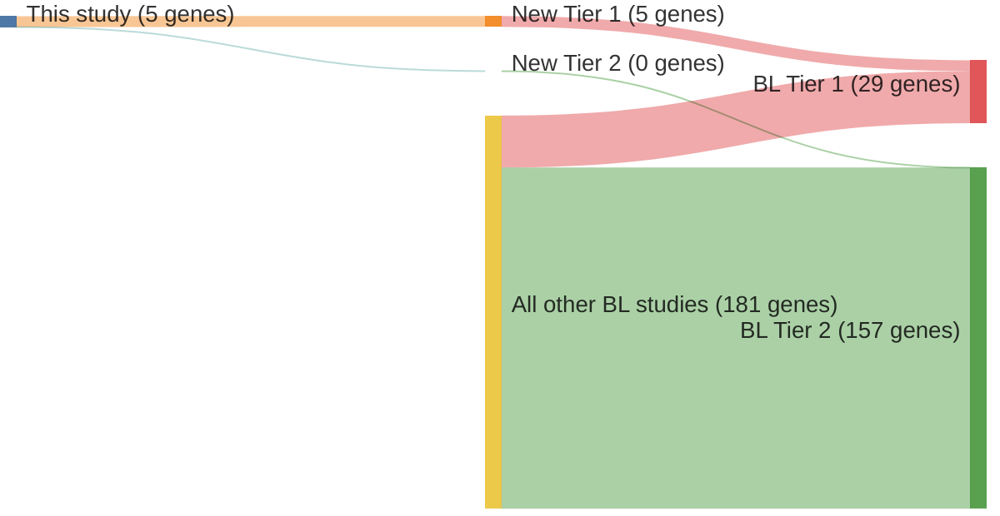

# @richterRecurrentMutationID32012a
## Summary of novel genes

|Entity| Tier 1 genes| Tier 2 genes|
|:-:|:-:|:-:|
|BL|5|0|

## Novel genes reported in this study

|New gene|BL tier|
|:-|:-:|
|[CCND3](../CCND3)|1 |
|[FBXO11](../FBXO11)|1 |
|[ID3](../ID3)|1 |
|[RHOA](../RHOA)|1 |
|[SMARCA4](../SMARCA4)|1 |

# Details

