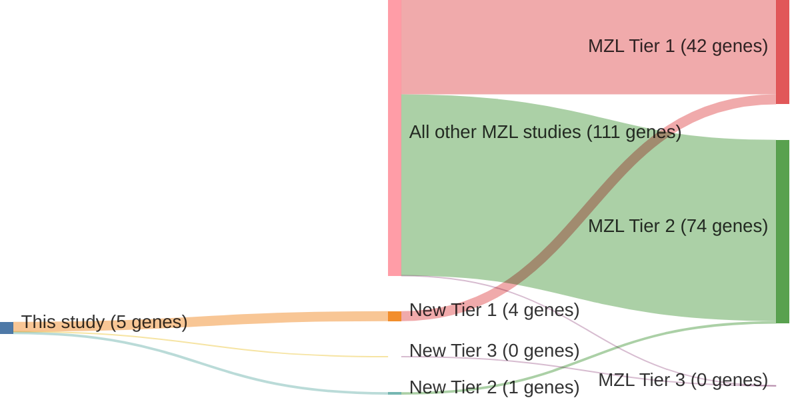

# @rossiAlterationBIRC3Multiple2011
## Summary of novel genes

|Entity| Tier 1 genes| Tier 2 genes|Tier 3 genes|
|:-:|:-:|:-:|:-:|
|MZL|4|1|0|

## Novel genes reported in this study

### Tier 1
|New gene|MZL tier|
|:-|:-:|
|[BIRC3](../BIRC3)|1 |
|[MAP3K14](../MAP3K14)|1 |
|[TNFAIP3](../TNFAIP3)|1 |
|[TRAF3](../TRAF3)|1 |

### Tier 2
|New gene|MZL tier|
|:-|:-:|
|[IKBKB](../IKBKB)|2 |

# Details

