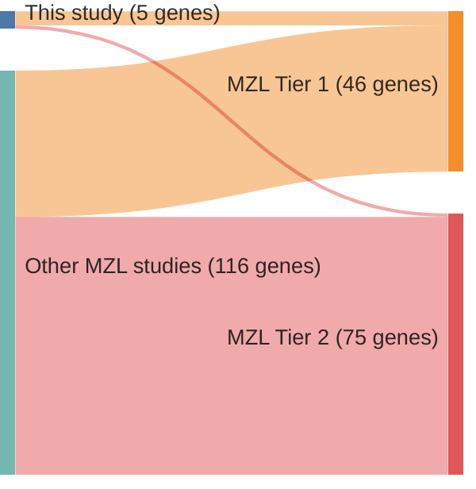

# @rossiAlterationBIRC3Multiple2011a
## Summary of novel genes

|Entity| Tier 1 genes| Tier 2 genes|
|:-:|:-:|:-:|
|MZL|4|1|

## Novel genes reported in this study

|New gene|MZL tier|
|:-|:-:|
|[BIRC3](BIRC3)|1 |
|[IKBKB](IKBKB)|2 |
|[MAP3K14](MAP3K14)|1 |
|[TNFAIP3](TNFAIP3)|1 |
|[TRAF3](TRAF3)|1 |

# Details

