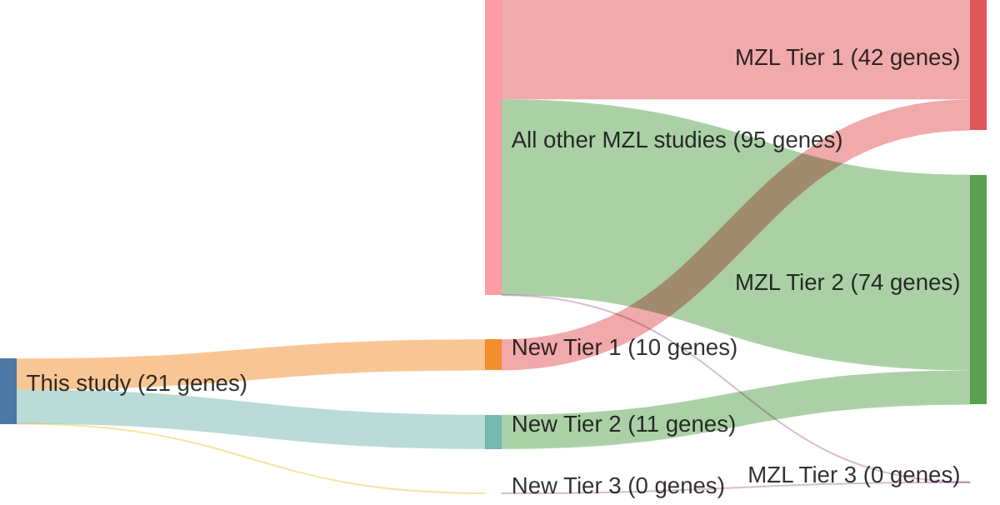

# @rossiCodingGenomeSplenic2012
## Summary of novel genes

|Entity| Tier 1 genes| Tier 2 genes|Tier 3 genes|
|:-:|:-:|:-:|:-:|
|MZL|10|11|0|

## Novel genes reported in this study

### Tier 1
|New gene|MZL tier|
|:-|:-:|
|[ARID1A](../ARID1A)|1 |
|[DTX1](../DTX1)|1 |
|[EP300](../EP300)|1 |
|[KMT2D](../KMT2D)|1 |
|[NOTCH1](../NOTCH1)|1 |
|[NOTCH2](../NOTCH2)|1 |
|[SIN3A](../SIN3A)|1 |
|[SPEN](../SPEN)|1 |
|[TBL1XR1](../TBL1XR1)|1 |
|[TP53](../TP53)|1 |

### Tier 2
|New gene|MZL tier|
|:-|:-:|
|[CD79A](../CD79A)|2 |
|[EGR1](../EGR1)|2 |
|[EGR2](../EGR2)|2 |
|[GPS2](../GPS2)|2 |
|[HIST1H2AG](../HIST1H2AG)|2 |
|[HIST1H2BK](../HIST1H2BK)|2 |
|[MCRS1](../MCRS1)|2 |
|[MSL2](../MSL2)|2 |
|[SWAP70](../SWAP70)|2 |
|[TRRAP](../TRRAP)|2 |
|[WAC](../WAC)|2 |

# Details

