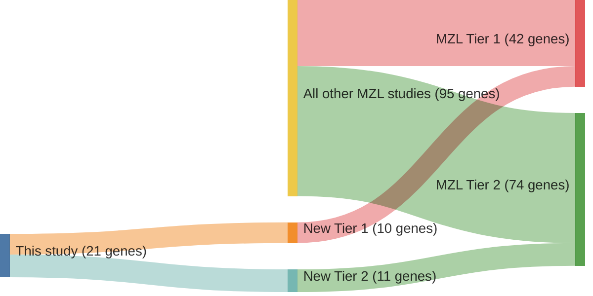

# @rossiCodingGenomeSplenic2012c
## Summary of novel genes

|Entity| Tier 1 genes| Tier 2 genes|
|:-:|:-:|:-:|
|DLBCL|12|2|
|MZL|10|11|

## Novel genes reported in this study

|New gene|DLBCL tier|MZL tier|
|:-|:-:|:-:|
|[ARID1A](../ARID1A)|1 |1 |
|[CD79A](../CD79A)| |2 |
|[DTX1](../DTX1)|1 |1 |
|[EGR1](../EGR1)| |2 |
|[EGR2](../EGR2)| |2 |
|[EP300](../EP300)|1 |1 |
|[GPS2](../GPS2)| |2 |
|[HIST1H2AG](../HIST1H2AG)|2 |2 |
|[HIST1H2BK](../HIST1H2BK)|1 |2 |
|[KMT2D](../KMT2D)|1 |1 |
|[MCRS1](../MCRS1)| |2 |
|[MSL2](../MSL2)| |2 |
|[NOTCH1](../NOTCH1)|1 |1 |
|[NOTCH2](../NOTCH2)|1 |1 |
|[SIN3A](../SIN3A)|1 |1 |
|[SPEN](../SPEN)|1 |1 |
|[SWAP70](../SWAP70)| |2 |
|[TBL1XR1](../TBL1XR1)|1 |1 |
|[TP53](../TP53)|1 |1 |
|[TRRAP](../TRRAP)|1 |2 |
|[WAC](../WAC)|2 |2 |

# Details

