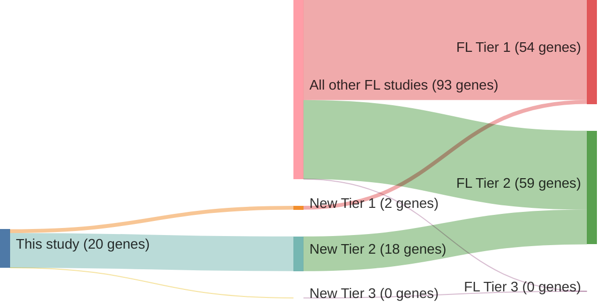

# @russler-germainMutationsAssociatedProgression2023
## Summary of novel genes

|Entity| Tier 1 genes| Tier 2 genes|Tier 3 genes|
|:-:|:-:|:-:|:-:|
|FL|2|18|0|

## Novel genes reported in this study

### Tier 1
|New gene|FL tier|
|:-|:-:|
|[BCL10](../BCL10)|1 |
|[CD83](../CD83)|1 |

### Tier 2
|New gene|FL tier|
|:-|:-:|
|[ABL2](../ABL2)|2 |
|[CD70](../CD70)|2 |
|[CILP](../CILP)|2 |
|[CYP2A6](../CYP2A6)|2 |
|[GBP7](../GBP7)|2 |
|[GRM6](../GRM6)|2 |
|[IGLL5](../IGLL5)|2 |
|[KIR3DL1](../KIR3DL1)|2 |
|[MAGEC1](../MAGEC1)|2 |
|[MAP7D1](../MAP7D1)|2 |
|[MKI67](../MKI67)|2 |
|[NFKBIA](../NFKBIA)|2 |
|[OR8H2](../OR8H2)|2 |
|[PZP](../PZP)|2 |
|[SHROOM3](../SHROOM3)|2 |
|[SRRM2](../SRRM2)|2 |
|[STAB2](../STAB2)|2 |
|[XIRP2](../XIRP2)|2 |

# Details

