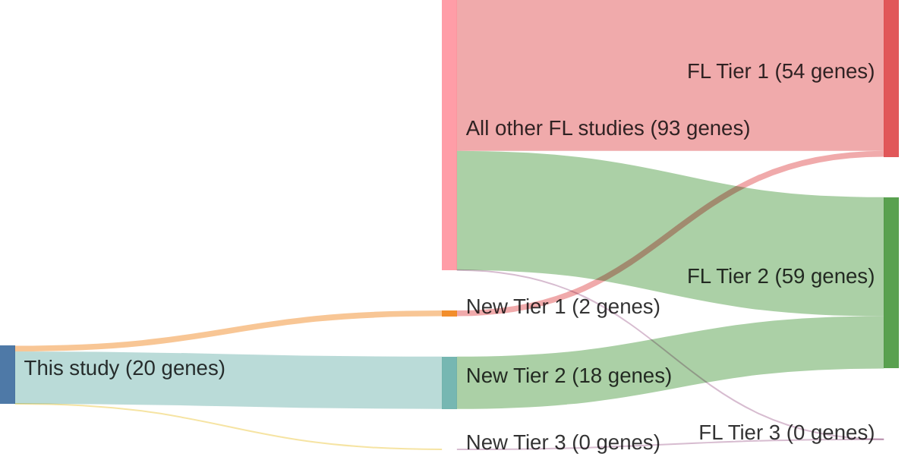

# @russler-germainMutationsAssociatedProgression2023

## Study Overview
In their 2023 study published in *Blood Advances*, Russler-Germain et al. conducted a comprehensive clinicogenomic analysis of 370 patients with follicular lymphoma (FL) or transformed FL (t-FL). The research aimed to elucidate the relationship between genetic alterations and patient outcomes, particularly focusing on mutations associated with disease progression. ([Source](https://ashpublications.org/bloodadvances/article/7/18/5524/497092/Mutations-associated-with-progression-in))

## Key Findings

### Mutation Burden
- No significant differences in mutation burden were observed among FL subsets categorized by grade, stage, watch-and-wait approach, or progression of disease within 24 months (POD24) status.
- However, mutation burden was notably higher in relapsed/refractory FL and t-FL compared to newly diagnosed FL.

### Specific Gene Mutations
- **CREBBP** mutations were more prevalent in FL than in t-FL and were associated with shorter frontline progression-free survival (PFS) in FL patients.
- Mutations in *STAT6*, *TP53*, *IGLL5*, *B2M*, *SOCS1*, and *MYD88* were more common in relapsed/refractory FL or t-FL than in newly diagnosed FL.

### Mutations Associated with Progression (MAP) Signature
- The MAP signature was defined as the presence of two or more mutations among the seven genes: *CREBBP*, *STAT6*, *TP53*, *IGLL5*, *B2M*, *SOCS1*, and *MYD8**.
- Patients with newly diagnosed FL possessing a MAP signature exhibited shorter frontline PFS, indicating a higher risk of disease progression.

## Clinical Implications
- The MAP signature may offer insights into FL progression risk, potentially providing a more generalizable prognostic tool than the m7-Follicular Lymphoma International Prognostic Index (m7-FLIPI).
- Identifying patients with a MAP signature at diagnosis could facilitate the development of targeted therapeutic strategies and inform clinical decision-making.

---

## Conclusion
Russler-Germain et al.'s study enhances the understanding of the genetic factors influencing FL progression. The identification of a MAP signature associated with inferior outcomes at diagnosis underscores the importance of genetic profiling in FL and highlights the potential for personalized treatment approaches in managing this heterogeneous disease.

## Summary of novel genes

|Entity| Tier 1 genes| Tier 2 genes|Tier 3 genes|
|:-:|:-:|:-:|:-:|
|FL|2|18|0|

## Novel genes reported in this study

### Tier 1
|New gene|FL tier|
|:-|:-:|
|[BCL10](../BCL10)|1 |
|[CD83](../CD83)|1 |

### Tier 2
|New gene|FL tier|
|:-|:-:|
|[ABL2](../ABL2)|2 |
|[CD70](../CD70)|2 |
|[CILP](../CILP)|2 |
|[CYP2A6](../CYP2A6)|2 |
|[GBP7](../GBP7)|2 |
|[GRM6](../GRM6)|2 |
|[IGLL5](../IGLL5)|2 |
|[KIR3DL1](../KIR3DL1)|2 |
|[MAGEC1](../MAGEC1)|2 |
|[MAP7D1](../MAP7D1)|2 |
|[MKI67](../MKI67)|2 |
|[NFKBIA](../NFKBIA)|2 |
|[OR8H2](../OR8H2)|2 |
|[PZP](../PZP)|2 |
|[SHROOM3](../SHROOM3)|2 |
|[SRRM2](../SRRM2)|2 |
|[STAB2](../STAB2)|2 |
|[XIRP2](../XIRP2)|2 |

# Details

