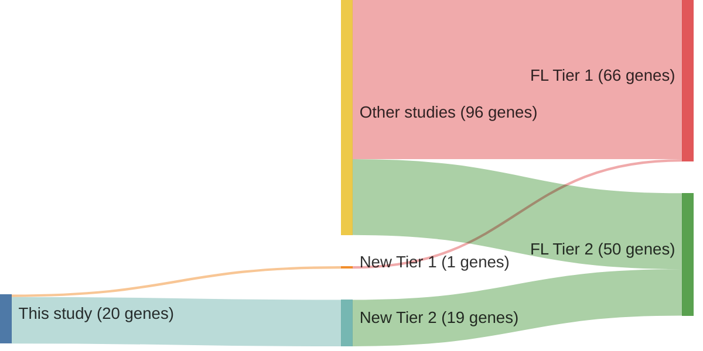

# @russler-germainMutationsAssociatedProgression2023b
## Summary of novel genes

|Entity| Tier 1 genes| Tier 2 genes|
|:-:|:-:|:-:|
|FL|1|19|

## Novel genes reported in this study

|New gene|FL tier|
|:-|:-:|
|[ABL2](ABL2)|2 |
|[BCL10](BCL10)|2 |
|[CD70](CD70)|2 |
|[CD83](CD83)|1 |
|[CILP](CILP)|2 |
|[CYP2A6](CYP2A6)|2 |
|[GBP7](GBP7)|2 |
|[GRM6](GRM6)|2 |
|[IGLL5](IGLL5)|2 |
|[KIR3DL1](KIR3DL1)|2 |
|[MAGEC1](MAGEC1)|2 |
|[MAP7D1](MAP7D1)|2 |
|[MKI67](MKI67)|2 |
|[NFKBIA](NFKBIA)|2 |
|[OR8H2](OR8H2)|2 |
|[PZP](PZP)|2 |
|[SHROOM3](SHROOM3)|2 |
|[SRRM2](SRRM2)|2 |
|[STAB2](STAB2)|2 |
|[XIRP2](XIRP2)|2 |

# Details

