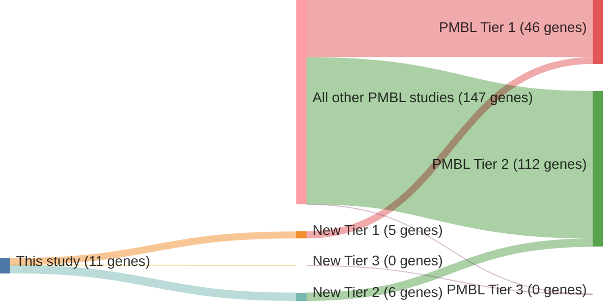

# @sarkozyMutationalLandscapeGray2021
## Summary of novel genes

|Entity| Tier 1 genes| Tier 2 genes|Tier 3 genes|
|:-:|:-:|:-:|:-:|
|PMBL|5|6|0|

## Novel genes reported in this study

### Tier 1
|New gene|PMBL tier|
|:-|:-:|
|[BIRC6](../BIRC6)|1 |
|[BTG1](../BTG1)|1 |
|[HIST1H1B](../HIST1H1B)|1 |
|[KMT2C](../KMT2C)|1 |
|[SPEN](../SPEN)|1 |

### Tier 2
|New gene|PMBL tier|
|:-|:-:|
|[ABCA13](../ABCA13)|2 |
|[BCL2](../BCL2)|2 |
|[LRRN3](../LRRN3)|2 |
|[MFHAS1](../MFHAS1)|2 |
|[NCOR2](../NCOR2)|2 |
|[RELN](../RELN)|2 |

# Details

