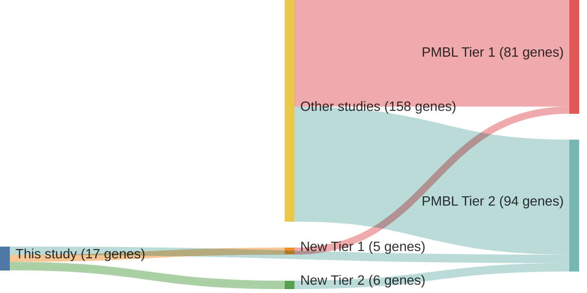

# @sarkozyMutationalLandscapeGray2021a
## Summary of novel genes

|Entity| Tier 1 genes| Tier 2 genes|
|:-:|:-:|:-:|
|PMBL|5|6|

## Novel genes reported in this study

|New gene|PMBL tier|
|:-|:-:|
|[ABCA13](ABCA13)|2 |
|[BCL2](BCL2)|2 |
|[BIRC6](BIRC6)|1 |
|[BTG1](BTG1)|1 |
|[HIST1H1B](HIST1H1B)|1 |
|[KMT2C](KMT2C)|1 |
|[LRRN3](LRRN3)|2 |
|[MFHAS1](MFHAS1)|2 |
|[NCOR2](NCOR2)|2 |
|[RELN](RELN)|2 |
|[SPEN](SPEN)|1 |

# Details

