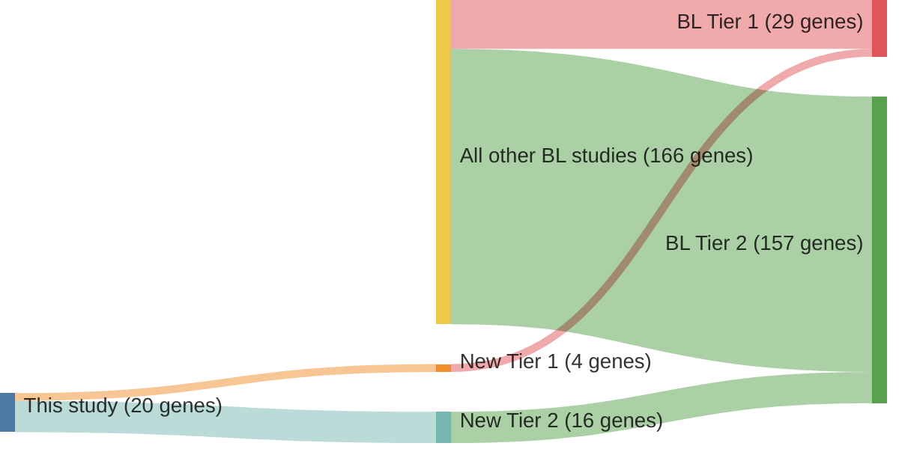

# @schmitzBurkittLymphomaPathogenesis2012
## Summary of novel genes

|Entity| Tier 1 genes| Tier 2 genes|
|:-:|:-:|:-:|
|BL|4|16|
|DLBCL|2|3|

## Novel genes reported in this study

|New gene|BL tier|DLBCL tier|
|:-|:-:|:-:|
|[C16orf48](C16orf48)|2 | |
|[DDX3X](DDX3X)|1 |1 |
|[DHCR7](DHCR7)|2 | |
|[ELP2](ELP2)|2 | |
|[EXOSC6](EXOSC6)|2 | |
|[FLYWCH1](FLYWCH1)|2 | |
|[FOXO1](FOXO1)|1 |1 |
|[GTSE1](GTSE1)|2 | |
|[ID3](ID3)|1 |2 |
|[KANK2](KANK2)|2 | |
|[MKI67](MKI67)|2 | |
|[MYO18A](MYO18A)|2 | |
|[NCOR2](NCOR2)|2 |2 |
|[PCBP1](PCBP1)|2 |2 |
|[PDCD11](PDCD11)|2 | |
|[TCF3](TCF3)|1 | |
|[TOP2A](TOP2A)|2 | |
|[WDR90](WDR90)|2 | |
|[WHAMM](WHAMM)|2 | |
|[YY1AP1](YY1AP1)|2 | |

# Details

