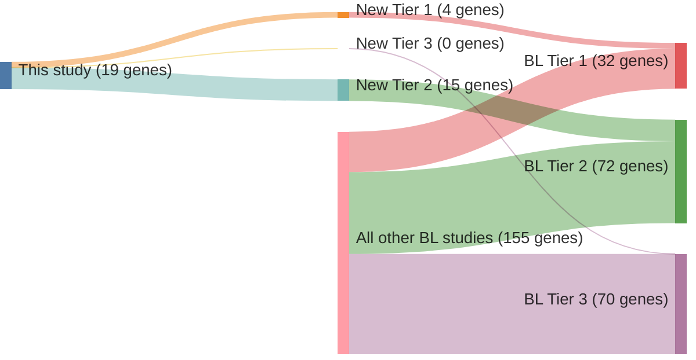

# @schmitzBurkittLymphomaPathogenesis2012
## Summary of novel genes

|Entity| Tier 1 genes| Tier 2 genes|Tier 3 genes|
|:-:|:-:|:-:|:-:|
|BL|4|15|0|

## Novel genes reported in this study

### Tier 1
|New gene|BL tier|
|:-|:-:|
|[DDX3X](../DDX3X)|1 |
|[FOXO1](../FOXO1)|1 |
|[PCBP1](../PCBP1)|1 |
|[TCF3](../TCF3)|1 |

### Tier 2
|New gene|BL tier|
|:-|:-:|
|[C16orf48](../C16orf48)|2 |
|[DHCR7](../DHCR7)|2 |
|[ELP2](../ELP2)|2 |
|[EXOSC6](../EXOSC6)|2 |
|[FLYWCH1](../FLYWCH1)|2 |
|[GTSE1](../GTSE1)|2 |
|[KANK2](../KANK2)|2 |
|[MKI67](../MKI67)|2 |
|[MYO18A](../MYO18A)|2 |
|[NCOR2](../NCOR2)|2 |
|[PDCD11](../PDCD11)|2 |
|[TOP2A](../TOP2A)|2 |
|[WDR90](../WDR90)|2 |
|[WHAMM](../WHAMM)|2 |
|[YY1AP1](../YY1AP1)|2 |

# Details

