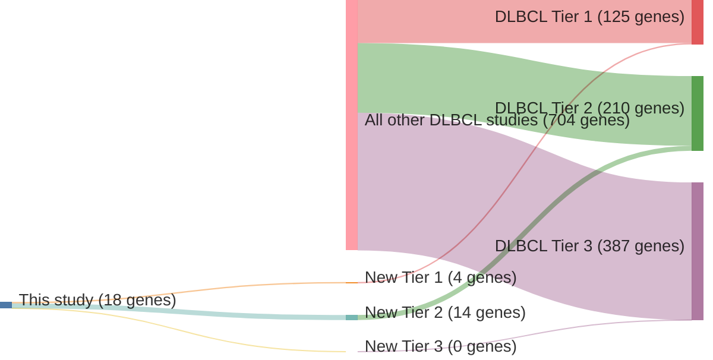

# @schmitzGeneticsPathogenesisDiffuse2018
## Summary of novel genes

|Entity| Tier 1 genes| Tier 2 genes|Tier 3 genes|
|:-:|:-:|:-:|:-:|
|DLBCL|4|14|0|

## Novel genes reported in this study

### Tier 1
|New gene|DLBCL tier|
|:-|:-:|
|[GRHPR](../GRHPR)|1 |
|[ITPKB](../ITPKB)|1 |
|[NOL9](../NOL9)|1 |
|[WEE1](../WEE1)|1 |

### Tier 2
|New gene|DLBCL tier|
|:-|:-:|
|[CXCR5](../CXCR5)|2 |
|[EIF2AK3](../EIF2AK3)|2 |
|[FOXC1](../FOXC1)|2 |
|[GPC5](../GPC5)|2 |
|[GSG2](../GSG2)|2 |
|[ID3](../ID3)|2 |
|[KLHL21](../KLHL21)|2 |
|[LAMA5](../LAMA5)|2 |
|[MYBPC2](../MYBPC2)|2 |
|[PAPOLG](../PAPOLG)|2 |
|[PRKDC](../PRKDC)|2 |
|[SEL1L3](../SEL1L3)|2 |
|[TAP1](../TAP1)|2 |
|[UBE2J1](../UBE2J1)|2 |

# Details

