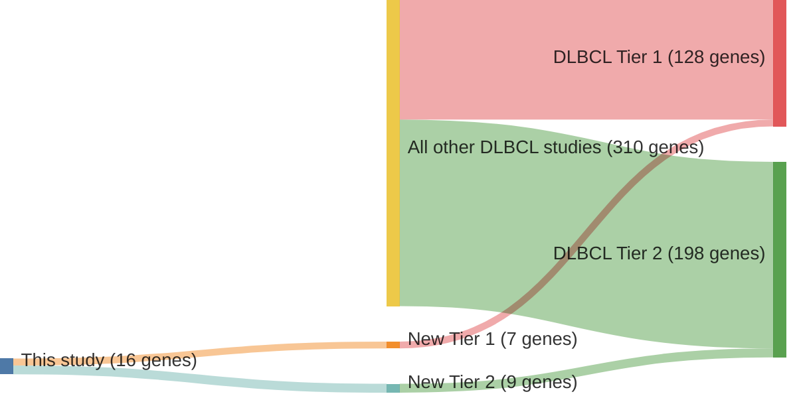

# @schmitzGeneticsPathogenesisDiffuse2018a
## Summary of novel genes

|Entity| Tier 1 genes| Tier 2 genes|
|:-:|:-:|:-:|
|DLBCL|7|9|

## Novel genes reported in this study

|New gene|DLBCL tier|
|:-|:-:|
|[CXCR5](CXCR5)|1 |
|[DDX3X](DDX3X)|1 |
|[DTX1](DTX1)|1 |
|[FOXC1](FOXC1)|2 |
|[GPC5](GPC5)|2 |
|[GSG2](GSG2)|2 |
|[HIST2H2BE](HIST2H2BE)|1 |
|[ITPKB](ITPKB)|1 |
|[KLHL21](KLHL21)|2 |
|[LAMA5](LAMA5)|2 |
|[MYBPC2](MYBPC2)|2 |
|[NOL9](NOL9)|1 |
|[PAPOLG](PAPOLG)|2 |
|[PRKDC](PRKDC)|2 |
|[TAP1](TAP1)|2 |
|[WEE1](WEE1)|1 |

# Details

