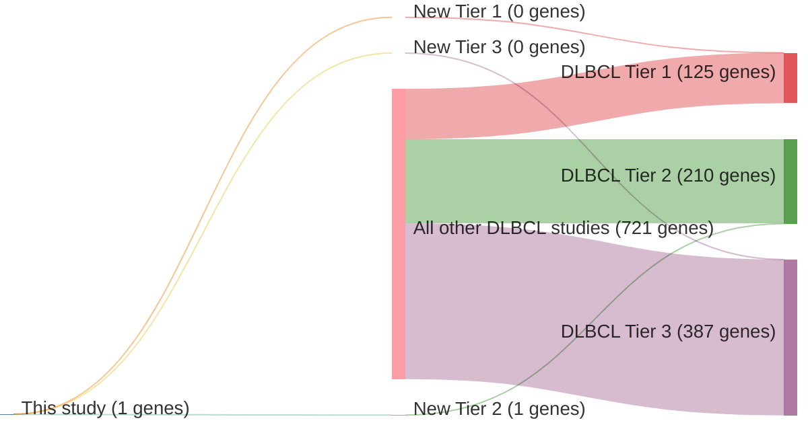

# @shinBRAFV600EMAP2K12015
## Summary of novel genes

|Entity| Tier 1 genes| Tier 2 genes|Tier 3 genes|
|:-:|:-:|:-:|:-:|
|DLBCL|0|1|0|

### Tier 2
|New gene|DLBCL tier|
|:-|:-:|
|[MAP2K1](../MAP2K1)|2 |

# Details

