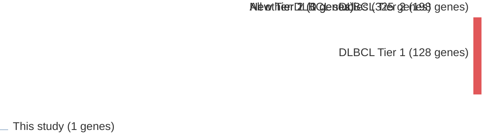

# @shinBRAFV600EMAP2K12015
## Summary of novel genes

|Entity| Tier 1 genes| Tier 2 genes|
|:-:|:-:|:-:|
|DLBCL||1|

## Novel genes reported in this study

|New gene|DLBCL tier|
|:-|:-:|
|[MAP2K1](MAP2K1)|2 |

# Details

