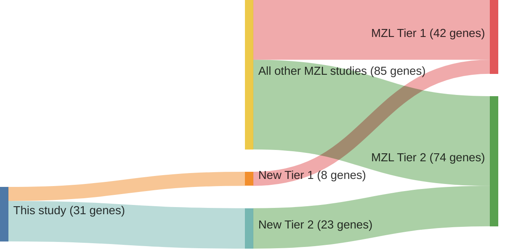

# @spinaGeneticsNodalMarginal2016b
## Summary of novel genes

|Entity| Tier 1 genes| Tier 2 genes|
|:-:|:-:|:-:|
|MZL|8|23|

## Novel genes reported in this study

|New gene|MZL tier|
|:-|:-:|
|[ABCA13](../ABCA13)|2 |
|[ACTG1](../ACTG1)|2 |
|[ADD2](../ADD2)|2 |
|[AMN](../AMN)|2 |
|[AOC2](../AOC2)|2 |
|[BCL10](../BCL10)|1 |
|[C6orf103](../C6orf103)|2 |
|[CDC42BPB](../CDC42BPB)|2 |
|[CDKN2A](../CDKN2A)|2 |
|[CLGN](../CLGN)|2 |
|[CNKSR2](../CNKSR2)|2 |
|[FAS](../FAS)|1 |
|[FAT1](../FAT1)|1 |
|[GPR98](../GPR98)|2 |
|[ID3](../ID3)|1 |
|[LRP1B](../LRP1B)|2 |
|[NCOR2](../NCOR2)|1 |
|[NOL9](../NOL9)|1 |
|[PACRG](../PACRG)|2 |
|[PARK2](../PARK2)|2 |
|[PLXNB3](../PLXNB3)|2 |
|[PTPRD](../PTPRD)|1 |
|[RCOR1](../RCOR1)|2 |
|[RPL1L](../RPL1L)|2 |
|[SAMD5](../SAMD5)|2 |
|[SCG3](../SCG3)|2 |
|[STXBP5](../STXBP5)|2 |
|[TAF1](../TAF1)|2 |
|[TCTN2](../TCTN2)|2 |
|[TNFRSF14](../TNFRSF14)|1 |
|[ZNF9](../ZNF9)|2 |

# Details

