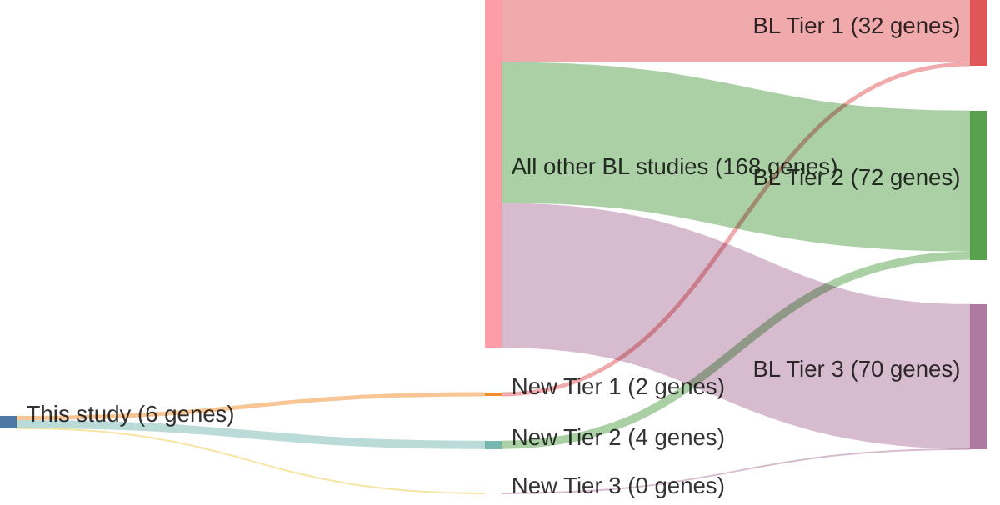

# @thomasGeneticSubgroupsInform2023
## Summary of novel genes

|Entity| Tier 1 genes| Tier 2 genes|Tier 3 genes|
|:-:|:-:|:-:|:-:|
|BL|2|4|0|

## Novel genes reported in this study

### Tier 1
|New gene|BL tier|
|:-|:-:|
|[PHF6](../PHF6)|1 |
|[WNK1](../WNK1)|1 |

### Tier 2
|New gene|BL tier|
|:-|:-:|
|[CDKN2C](../CDKN2C)|2 |
|[EBF1](../EBF1)|2 |
|[EHD1](../EHD1)|2 |
|[TET2](../TET2)|2 |

# Details

