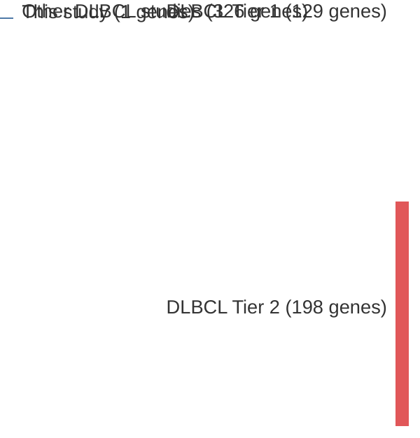

# @tiacciBRAFMutationsHairycell2011a
## Summary of novel genes

|Entity| Tier 1 genes| Tier 2 genes|
|:-:|:-:|:-:|
|DLBCL|1||

## Novel genes reported in this study

|New gene|DLBCL tier|
|:-|:-:|
|[BRAF](BRAF)|1 |

# Details

