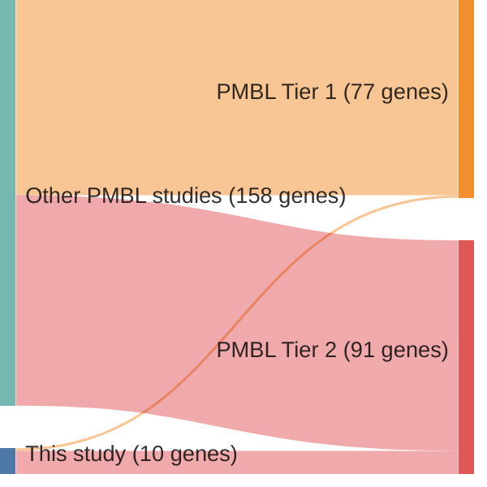

# @tiacciPervasiveMutationsJAKSTAT2018b
## Summary of novel genes

|Entity| Tier 1 genes| Tier 2 genes|
|:-:|:-:|:-:|
|PMBL|1|9|

## Novel genes reported in this study

|New gene|PMBL tier|
|:-|:-:|
|[AKAP6](AKAP6)|2 |
|[DGKB](DGKB)|2 |
|[ITPR3](ITPR3)|2 |
|[NUP214](NUP214)|2 |
|[PRUNE2](PRUNE2)|2 |
|[SETD5](SETD5)|2 |
|[STAT5B](STAT5B)|2 |
|[TNIP1](TNIP1)|2 |
|[TP53](TP53)|1 |
|[ZCCHC11](ZCCHC11)|2 |

# Details

