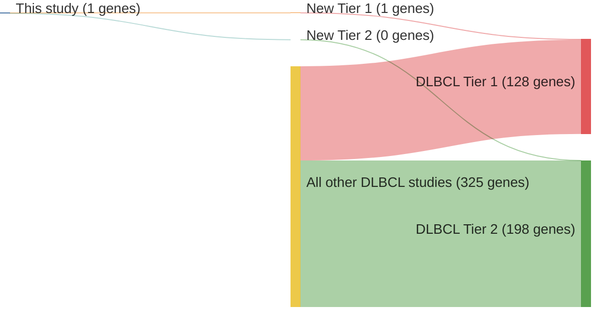

# @troenNOTCH2MutationsMarginal2008
## Summary of novel genes

|Entity| Tier 1 genes| Tier 2 genes|
|:-:|:-:|:-:|
|DLBCL|1|0|

## Novel genes reported in this study

### Tier 1
|New gene|DLBCL tier|
|:-|:-:|
|[NOTCH2](../NOTCH2)|1 |

# Details

