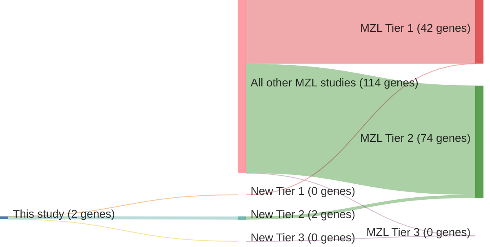

# @vandenbrandRecurrentMutationsGenes2017
## Summary of novel genes

|Entity| Tier 1 genes| Tier 2 genes|Tier 3 genes|
|:-:|:-:|:-:|:-:|
|MZL|0|2|0|

### Tier 2
|New gene|MZL tier|
|:-|:-:|
|[CD9B](../CD9B)|2 |
|[TNIP2](../TNIP2)|2 |

# Details

