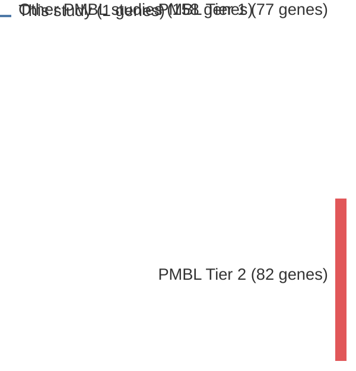

# @viganoSomaticIL4RMutations2018b
## Summary of novel genes

|Entity| Tier 1 genes| Tier 2 genes|
|:-:|:-:|:-:|
|PMBL|1||

## Novel genes reported in this study

|New gene|PMBL tier|
|:-|:-:|
|[IL4R](IL4R)|1 |

# Details

