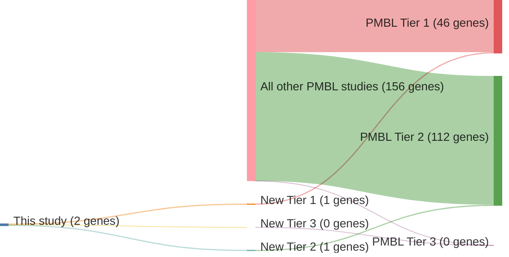

# @wenigerMutationsTumorSuppressor2006
## Summary of novel genes

|Entity| Tier 1 genes| Tier 2 genes|Tier 3 genes|
|:-:|:-:|:-:|:-:|
|PMBL|1|1|0|

## Novel genes reported in this study

### Tier 1
|New gene|PMBL tier|
|:-|:-:|
|[SOCS1](../SOCS1)|1 |

### Tier 2
|New gene|PMBL tier|
|:-|:-:|
|[GPR126](../GPR126)|2 |

# Details

