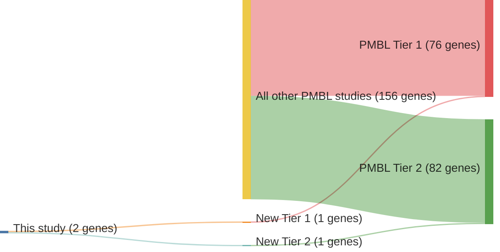

# @wenigerMutationsTumorSuppressor2006a
## Summary of novel genes

|Entity| Tier 1 genes| Tier 2 genes|
|:-:|:-:|:-:|
|PMBL|1|1|

## Novel genes reported in this study

|New gene|PMBL tier|
|:-|:-:|
|[GPR126](GPR126)|2 |
|[SOCS1](SOCS1)|1 |

# Details

