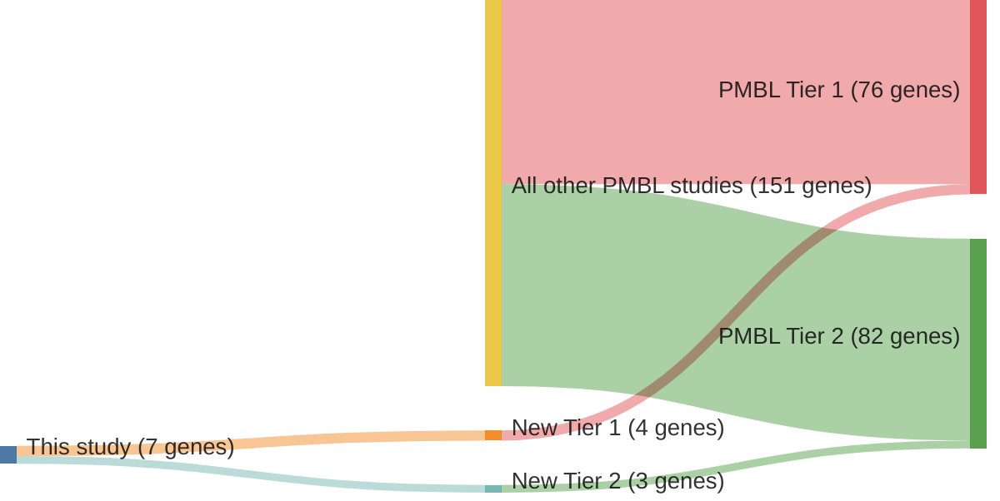

# @wienandGenomicAnalysesFlowsorted2019b
## Summary of novel genes

|Entity| Tier 1 genes| Tier 2 genes|
|:-:|:-:|:-:|
|PMBL|4|3|

## Novel genes reported in this study

### Tier 1
|New gene|PMBL tier|
|:-|:-:|
|[ACTB](../ACTB)|1 |
|[ARID1A](../ARID1A)|1 |
|[HLA-B](../HLA-B)|1 |
|[NFKBIA](../NFKBIA)|1 |

### Tier 2
|New gene|PMBL tier|
|:-|:-:|
|[DNAH12](../DNAH12)|2 |
|[IKBKB](../IKBKB)|2 |
|[RBM38](../RBM38)|2 |

# Details

