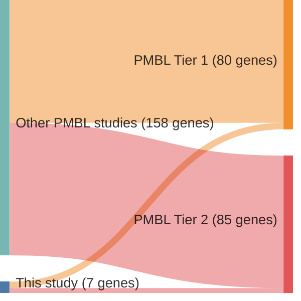

# @wienandGenomicAnalysesFlowsorted2019b
## Summary of novel genes

|Entity| Tier 1 genes| Tier 2 genes|
|:-:|:-:|:-:|
|PMBL|4|3|

## Novel genes reported in this study

|New gene|PMBL tier|
|:-|:-:|
|[ACTB](ACTB)|1 |
|[ARID1A](ARID1A)|1 |
|[DNAH12](DNAH12)|2 |
|[HLA-B](HLA-B)|1 |
|[IKBKB](IKBKB)|2 |
|[NFKBIA](NFKBIA)|1 |
|[RBM38](RBM38)|2 |

# Details

