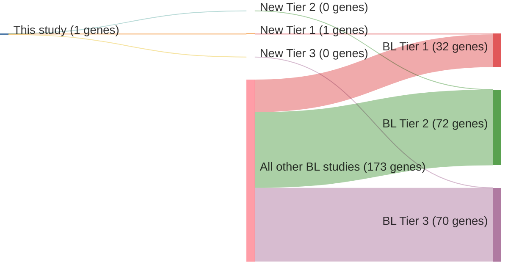

# @wildaInactivationARFMDM2p53Pathway2004
## Summary of novel genes

|Entity| Tier 1 genes| Tier 2 genes|Tier 3 genes|
|:-:|:-:|:-:|:-:|
|BL|1|0|0|

## Novel genes reported in this study

### Tier 1
|New gene|BL tier|
|:-|:-:|
|[TP53](../TP53)|1 |

# Details

